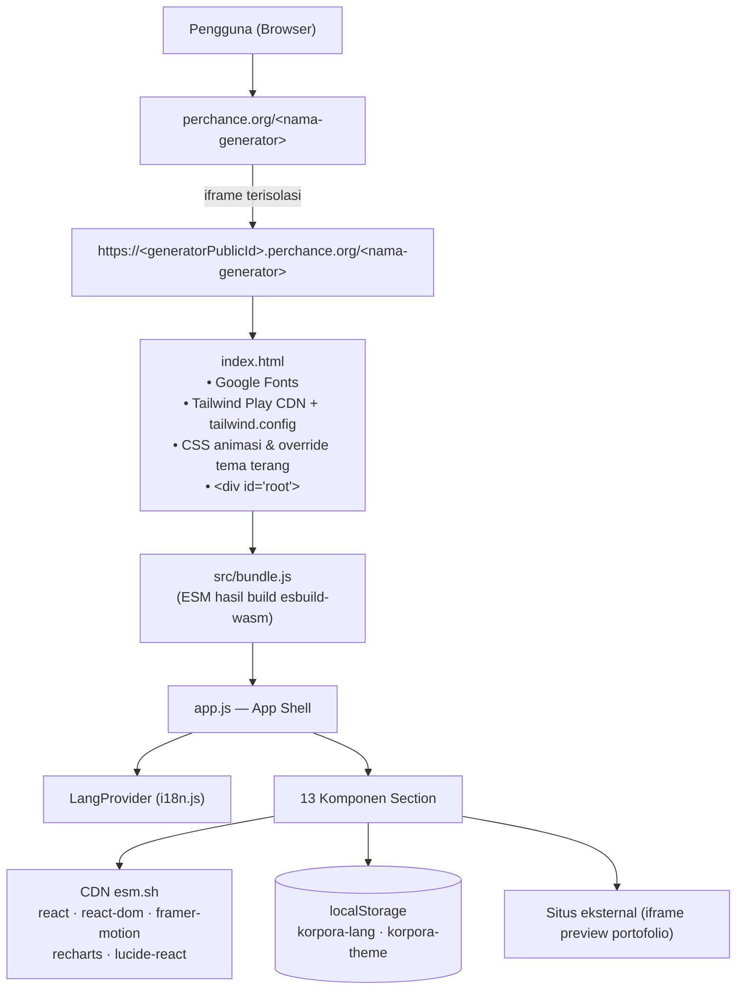
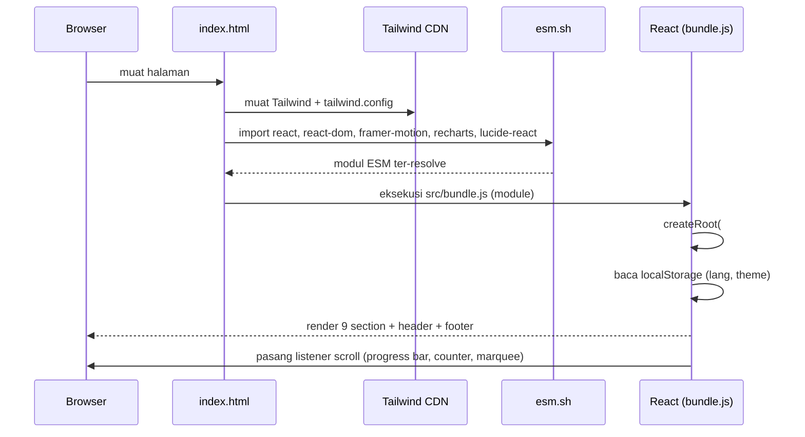
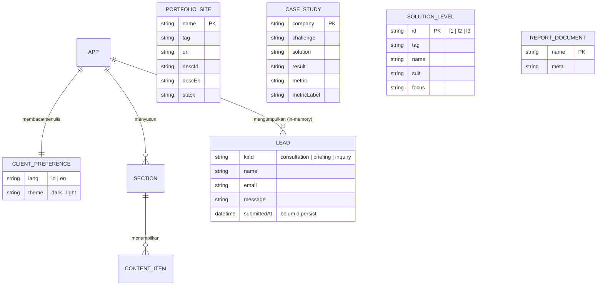

# Bab 3 — Dokumentasi Arsitektur & Perancangan

## 3.1 System Architecture / Tech Stack

### 3.1.1 Bahasa & Framework

| Lapisan | Teknologi | Versi | Keterangan |
|---|---|---|---|
| Bahasa | JavaScript (ES2022) | — | Sumber ditulis dalam **JSX**; dikompilasi ke ESM |
| Markup | HTML5 | — | `index.html` (shell) |
| Styling | CSS3 | — | Ditulis sebagai *utility class* Tailwind + keyframes CSS kustom |
| Framework UI | **React** | **18.3.1** | Wajib pinned (lihat catatan di 3.1.4) |
| Renderer DOM | **react-dom** | **18.3.1** | Digunakan via `/client` |
| Build tool | **esbuild-wasm** | 0.21.5 | Dijalankan sekali untuk menghasilkan `bundle.js` |
| CSS framework | **Tailwind CSS** (Play CDN) | v3 (runtime, via `cdn.tailwindcss.com`) | Konfigurasi kustom di `index.html` |
| Animasi | **Framer Motion** | **11.18.2** | Akordeon FAQ, transisi elemen, counter angka |
| Grafik | **Recharts** | **2.x** (pinned major) | Grafik area pada mockup finansial Hero |
| Ikon | **lucide-react** | **0.469.0** | Seluruh ikon UI |
| Font | Google Fonts | — | Syne, Space Grotesk, Inter, JetBrains Mono |
| Runtime host | Perchance | — | Halaman dijalankan dalam *iframe* |

### 3.1.2 Database / Penyimpanan

| Sistem | Teknologi | Versi | Penggunaan |
|---|---|---|---|
| Database relasional | **Tidak ada** | — | Project murni frontend; tidak ada server DB |
| Penyimpanan klien | **`localStorage`** | Web Storage API | Hanya 2 preferensi pengguna (bahasa, tema) |
| Sumber konten | **Konstanta JS** | — | Seluruh konten (portofolio, pilar, FAQ, dll.) *hard-coded* di dalam komponen |

> **Catatan penting:** bagian *Database Structure* pada template laporan (ERD/skema tabel) di project ini dipetakan menjadi **skema data statis + skema preferensi klien** pada bagian 3.3. Tidak ada tabel SQL/NoSQL karena tidak ada backend.

### 3.1.3 Library / Tool Pendukung

| Tool | Fungsi |
|---|---|
| `esm.sh` | CDN modul ESM; seluruh dependency eksternal dipin ke versi tertentu |
| `cdn.tailwindcss.com` | Tailwind Play CDN (JIT di browser) — **hanya untuk pengembangan/prototipe** |
| Google Fonts | Penyediaan 4 keluarga font |
| Perchance platform | Hosting halaman + manajemen generator |

### 3.1.4 Catatan Kompatibilitas Kritis

1. **React harus dipin 18.3.1** di setiap URL esm.sh (`?deps=react@18.3.1,react-is@18.3.1`). Bila tidak, esm.sh akan menarik **React 19** sebagai peer, sementara `react-dom@18` tetap dipakai → error runtime `useContext` pada `null` (aplikasi blank).
2. **Tailwind Play CDN memunculkan peringatan** `cdn.tailwindcss.com should not be used in production`. Untuk produksi disarankan build Tailwind via CLI/PostCSS (lihat Bab 4).
3. **JSX tidak bisa dijalankan browser.** Tidak ada *import map* di lingkungan target, karena itu seluruh JSX dikompilasi ke satu `bundle.js`.

---

## 3.2 Arsitektur Sistem

### 3.2.1 Diagram Arsitektur



### 3.2.2 Alur Render (Sequence)



### 3.2.3 Pola Arsitektur

| Aspek | Pendekatan |
|---|---|
| Struktur | **Single Page Application (SPA)**, *section-based scrolling* dengan navigasi *anchor* |
| Komposisi | *Component-based*; satu berkas per section, komponen dasar dipakai ulang dari `ui.jsx` |
| State global | React Context untuk **bahasa** (`LangProvider`/`useLang`); state lokal `useState` untuk tema & modal di `app.js` |
| State lokal | `useState` per komponen (FAQ terbuka, form terisi, status sukses) |
| Persistensi | `localStorage` (2 kunci), dibungkus `try/catch` agar aman pada mode privat |
| Styling | Utility-first (Tailwind) + kelas kustom (`.dark-window`, `.anim-*`, `.korp-marquee`) untuk pengecualian |
| Konten | Konstanta array/objek per komponen; versi ID & EN berdampingan (`{ id: {...}, en: {...} }`) |
| i18n | Kamus *inline* per komponen, dipilih lewat `lang === 'en' ? … : …` |

---

## 3.3 Struktur Data (Pengganti ERD)

Karena project tidak memakai database, "skema tabel" di sini adalah **skema data klien**: (a) dua entitas *persisten* di `localStorage`, (b) koleksi konten statis, dan (c) tiga entitas **virtual** (data formulir yang saat ini hanya hidup di memori).

### 3.3.1 ERD (logis)



### 3.3.2 Entitas Persisten — `localStorage`

| Key | Tipe | Nilai valid | Default | Ditulis oleh | Dibaca oleh |
|---|---|---|---|---|---|
| `korpora-lang` | string | `"id"` \| `"en"` | `"id"` | `i18n.js` → `LangProvider` | `LangProvider` (state awal) |
| `korpora-theme` | string | `"dark"` \| `"light"` | `"dark"` | `app.js` (efek samping perubahan state) | `getInitialTheme()` di `app.js` |

Penulisan selalu dibungkus `try/catch` — bila gagal (mis. *storage* diblokir), aplikasi tetap berjalan dengan default.

### 3.3.3 Koleksi Konten Statis

| Koleksi (konstanta) | Berkas | Field | Jumlah item |
|---|---|---|---|
| `SITES` | `Portfolio.jsx` | `name, tag, url, descId, descEn, stack[]` | 15 — **daftar URL lengkap: Bab 2 §2.4** |
| `STATS_BASE` | `BenefitPillars.jsx` | `to, prefix, suffix, label` | 4 (per bahasa) |
| `PILLARS_BASE` | `BenefitPillars.jsx` | `icon, accent, line, id{title,desc}, en{title,desc}` | 4 |
| `LEVELS_BASE` | `CorporateShowcase.jsx` | `id, icon, accent, line, num, tag, idT{…}, enT{…}, stack[]` | 3 |
| `CASES_BASE` | `CaseStudies.jsx` | `icon, accent, line, id{…}, en{…}` | 2 |
| `SCOPE_BASE` | `ScopePaket.jsx` | `icon, num, id{t,d}, en{t,d}` | 4 |
| `ADDON_BASE` | `ScopePaket.jsx` | `icon, t, d` | 3 (per bahasa) |
| `FAQ_BASE` | `EnterpriseFaq.jsx` | `icon, id{q,a}, en{q,a}` | 3 |
| `reports` | `EnterpriseWidgets.jsx` | `icon, name, meta` | 4 (per bahasa) |
| `SERIES` | `EnterpriseHero.jsx` | `label, color, growth, id{name,unit}, en{name,unit}, data[{l,v,s}]` | 2 seri × 6 titik |
| `SOLUTIONS_DATA` | `EnterpriseHeader.jsx` | `icon, name, desc, tag, href` | 3 (per bahasa) |
| `COLUMNS_BASE` | `Footer.jsx` | `title, links[]` | 3 (per bahasa) |

### 3.3.4 Entitas Virtual (Formulir — belum dipersist)

| Entitas | Komponen | Field UI | Field diterima state | Persistensi |
|---|---|---|---|---|
| `CONSULTATION_BOOKING` | `EnterpriseCta.jsx` | `name`, `email` | `{name, email}` | ❌ hanya `useState` → tampil sukses, tidak dikirim |
| `INQUIRY` (whistleblowing/pengadaan) | `EnterpriseWidgets.jsx` | `name`, `email`, `message` | tidak disimpan sama sekali | ❌ hanya flag `sent` |
| `MODAL_CONSULT` | `EnterpriseModal.jsx` | `email` | `{email}` | ❌ hanya `useState` |

> Untuk whistleblowing, **jangan** pernah menyimpan identitas pelapor secara sembarangan; lihat desain kanal anonim pada Bab 6 §6.3.

---

## 3.4 API Documentation

> **Status:** project ini **belum memiliki API HTTP apa pun**. Bagian 3.4.1–3.4.3 mendokumentasikan "API" yang benar-benar ada saat ini (internal, penyimpanan, dan modul eksternal). Bagian 3.4.4 adalah **kontrak API yang diusulkan** untuk backend pada fase berikutnya.

### 3.4.1 Internal JS API (komponen & hook)

| API | Tipe | Signature | Deskripsi |
|---|---|---|---|
| `useLang()` | hook | `() => { lang: 'id'\|'en', setLang(l) }` | Mengambil & mengubah bahasa aktif. Fallback: `{lang:'id', setLang:noop}` bila dipakai di luar provider. |
| `LangProvider` | komponen | `<LangProvider>{children}</LangProvider>` | Menyediakan konteks bahasa + persistensi ke `localStorage`. |
| `AnimatedNumber` | komponen | `{ to:number, duration?:1.8, prefix?:string, suffix?:string, decimals?:0, className?:string }` | Counter angka animasi (`framer-motion` `animate`); fallback ke nilai akhir setelah 1,2 s bila belum masuk viewport. |
| `Button` | komponen | `{ variant?:'primary'\|'cyan'\|'ghost'\|'outline'\|'white'\|'darkOnLight', size?:'sm'\|'md'\|'lg'\|'xl', as?:'button'\|'a', icon?:node, ...rest }` | Tombol serbaguna (`forwardRef`), mendukung `as="a"` untuk tautan. |
| `MotionReveal` | komponen | `{ children, delay?, y?, className?, style?, section?:bool }` | Pembungkus blok section (saat ini **wrapper statis**, lihat Bab 6 §6.2). |
| `Reveal` | komponen | `{ children, delay?, className?, as? }` | Pembungkus ringan (statis). |
| `Badge` | komponen | `{ tone?:'default'\|'accent'\|'cyan'\|'glow' }` | Label kecil bergaya pil. |
| `Kicker` | komponen | `{ children }` | Teks *eyebrow* dengan garis gradien. |
| `SectionHeading` | komponen | `{ kicker, title, desc?, align?:'left'\|'center' }` | Blok judul section standar. |
| `GlassCard` | komponen | `{ children, hover?:bool, className? }` | Kartu *glassmorphism* dengan efek hover. |
| `Logo` | komponen | `{ className? }` | Logo `KORPORA` (dipakai Header & Footer). |
| `EnterpriseModal` | komponen | `{ open:bool, onClose:fn }` | Modal konsultasi (render `null` bila `open=false`). |
| `EnterpriseHeader` | komponen | `{ dark:bool, toggleDark:fn, onConsult:fn }` | Header; `onConsult` **hanya terpakai di drawer mobile**. |
| `EnterpriseHero` | komponen | `{ onConsult:fn }` | Hero; saat ini **tidak menerima** `onConsult` di `app.js` (bug — Bab 6 §6.1). |

### 3.4.2 Storage API

| Operasi | Kunci | Nilai | Catatan |
|---|---|---|---|
| Baca | `korpora-lang` | `"id"`/`"en"` | `i18n.js` — inisialisasi state |
| Tulis | `korpora-lang` | `"id"`/`"en"` | saat toggle bahasa |
| Baca | `korpora-theme` | `"dark"`/`"light"` | `app.js` — `getInitialTheme()` |
| Tulis | `korpora-theme` | `"dark"`/`"light"` | efek `useEffect` saat tema berubah |

### 3.4.3 External Module API (CDN)

| Modul | URL (dipin) | Dipakai di |
|---|---|---|
| react | `https://esm.sh/react@18.3.1` | semua komponen |
| react-dom/client | `https://esm.sh/react-dom@18.3.1/client` | `app.js` |
| jsx-runtime | `https://esm.sh/react@18.3.1/jsx-runtime` | hasil kompilasi JSX |
| framer-motion | `https://esm.sh/framer-motion@11.18.2?deps=react@18.3.1,react-is@18.3.1` | `ui.jsx`, `EnterpriseHero`, `EnterpriseFaq` |
| recharts | `https://esm.sh/recharts@2?deps=react@18.3.1,react-is@18.3.1` | `EnterpriseHero` |
| lucide-react | `https://esm.sh/lucide-react@0.469.0?deps=react@18.3.1` | hampir semua komponen |
| Tailwind | `https://cdn.tailwindcss.com` | `index.html` |

### 3.4.4 Kontrak API yang Diusulkan (belum diimplementasikan)

Berikut rancangan endpoint agar frontend bisa disambungkan ke backend/CRM tanpa mengubah struktur data di sisi UI. **Semua endpoint belum ada.**

**a) `POST /api/v1/leads/consultation`** — dari modal konsultasi & booking briefing

```json
// Request
{
  "source": "modal_consultation",
  "name": "Budi Santoso",
  "email": "budi@perusahaan.co.id",
  "company": "PT Contoh Tbk",
  "slot": "2026-09-21T09:30:00+07:00",
  "lang": "id"
}
// Response 201
{ "id": "lead_8f3c1a", "status": "queued", "message": "Tim kami akan menghubungi Anda." }
```

**b) `POST /api/v1/inquiries`** — kanal *whistleblowing*/pengadaan (harus dirancang **anonim & terenkripsi**)

```json
// Request
{ "type": "procurement|concern", "message": "…", "contact": null, "attachments": [] }
// Response 202
{ "receipt": "WB-2026-0007", "receivedAt": "2026-09-17T10:12:00+07:00" }
```

**c) `GET /api/v1/reports`** — daftar dokumen *Report Center*

```json
// Response 200
{
  "items": [
    { "id": "ar-fy25", "title": "Annual Report FY25", "fileUrl": "https://…/ar-fy25.pdf", "size": "8.4 MB", "lang": ["id","en"] }
  ]
}
```

**d) `GET /api/v1/portfolio`** — daftar situs portofolio (menggantikan `SITES` hard-coded)

```json
{
  "items": [
    { "name": "Aetheria", "tag": "Creative Tech Studio", "url": "https://…", "stack": ["React","Next.js"], "desc": { "id": "…", "en": "…" } }
  ]
}
```

**Kebutuhan non-fungsional:** proteksi bot (honeypot / CAPTCHA), *rate limit* per IP, validasi email, CSP, dan pencatatan audit untuk kanal whistleblowing.

---

## 3.5 Design System & Perancangan Tampilan

### 3.5.1 Palet Warna (didefinisikan di `tailwind.config`)

| Token | Hex | Penggunaan |
|---|---|---|
| `obsidian` | `#0B0F19` | Latar utama (tema gelap) |
| `obsidian2` | `#0E1424` | Panel/mockup |
| `obsidian3` | `#131B2E` | Elemen dalam mockup |
| `electric` | `#06B6D4` | Aksen sekunder (cyan) |
| `corporate` | `#4F46E5` | Aksen utama (indigo) |

Palet semantik tambahan memakai bawaan Tailwind (`slate`, `indigo`, `cyan`, `emerald`, `violet`).

### 3.5.2 Tipografi

| Peran | Font | Kelas Tailwind |
|---|---|---|
| Heading | Syne (500–800) | `font-heading` |
| Display/angka | Space Grotesk (400–700) | `font-display` |
| Body | Inter (400–700) | `font-sans` (default) |
| Meta/mono | JetBrains Mono (400–600) | `font-mono` |

### 3.5.3 Prinsip Desain

1. **"Code is cheap, governance is expensive."** Narasi utama bukan fitur teknis, melainkan tata kelola, kepatuhan, dan skala.
2. **Mockup sebagai bukti.** Kotak gelap bergaya jendela browser (`.dark-window`) menampilkan "produk" — grafik finansial, portal IR — sekaligus tetap terbaca di tema terang.
3. **Kepadatan enterprise.** Grid rapi, label mono huruf besar sebagai penanda kredibilitas teknis.
4. **Gerak yang tenang.** Animasi halus (`float`, `marquee`, `scan`) untuk kesan premium, dimatikan saat `prefers-reduced-motion`.

### 3.5.4 Peta Section → Anchor

| Section | Anchor | Modul |
|---|---|---|
| Hero | `#top` | M-05 |
| Portfolio | `#portfolio` | M-07 |
| Pilar Enterprise | `#pillars` | M-08 |
| Level Solusi | `#templates` | M-09 |
| Report Center & Whistleblowing | `#laporan` | M-10 |
| Case Studies | `#studi` | M-11 |
| Scope & Paket | `#paket` | M-12 |
| FAQ | `#faq` | M-13 |
| CTA / Booking | `#quote` | M-14 |

---

## 3.6 Build Pipeline

```
src/*.jsx  ──(esbuild-wasm: loader jsx, jsx:automatic, format esm)──▶  src/bundle.js  ──▶  index.html <script type="module">
```

- Impor *bare* (`react`, `react-dom/client`, `framer-motion`, `recharts`, `lucide-react`) dibiarkan **external** → diselesaikan browser lewat URL esm.sh.
- Impor relatif (`./ui.jsx`, `../i18n.js`) diselesaikan plugin esbuild dengan *namespace* `ws` (membaca berkas workspace) dan loader `jsx`.
- **Setiap kali berkas di `src/*.jsx` diubah, `bundle.js` WAJIB dibangun ulang**, jika tidak perubahan tidak akan tampil di browser.
