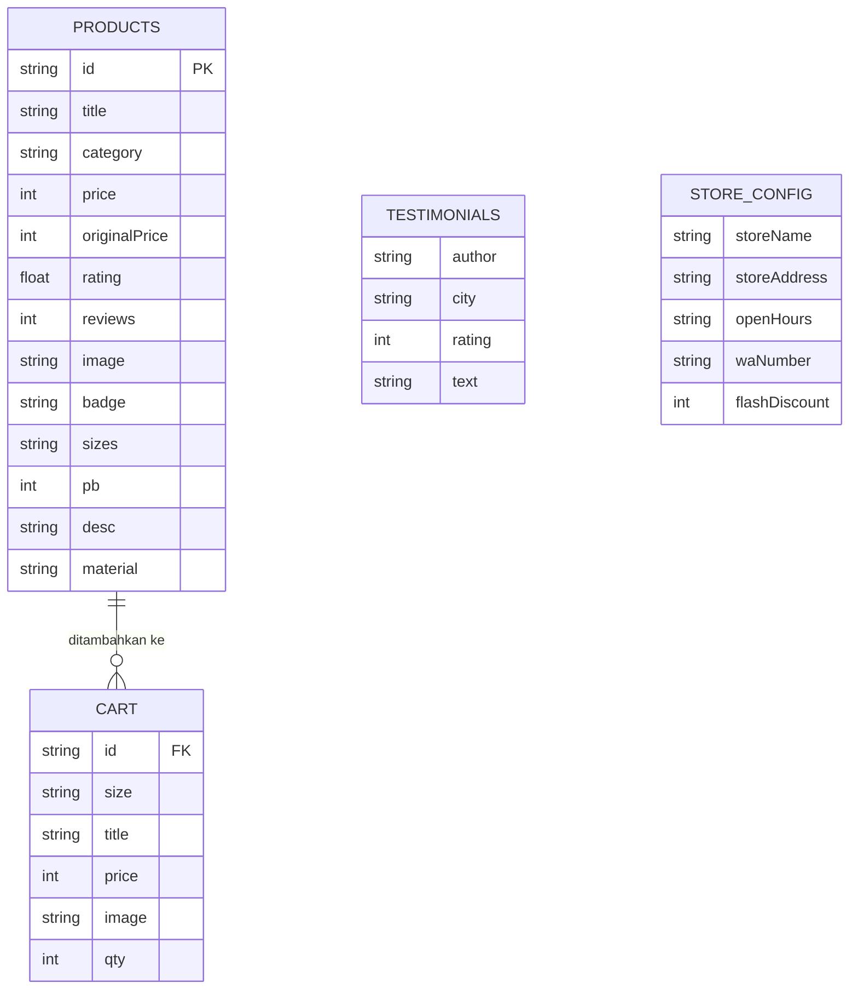

# Dokumentasi & Laporan Akhir Kerja Praktek (KP)

**Judul Project:** Cantara Batik — Website Katalog & Pemesanan Batik Pekalongan
**Nama Mahasiswa:** [Nama Mahasiswa]
**NIM:** [NIM]
**Program Studi:** [Program Studi]
**Perusahaan / Instansi KP:** [Nama Perusahaan]
**Periode KP:** [Tanggal Mulai] – [Tanggal Selesai]
**Versi Dokumen:** 1.0 — [tanggal]
**URL Generator (Production):** https://perchance.org/[nama-generator]

> Catatan: bagian "Cara Kerja Web" dibahas terpisah dan tidak diulang di dokumen ini. Fokus dokumen ini adalah latar belakang, inventaris modul, arsitektur/perancangan, panduan instalasi & deployment, hasil pengujian, serta catatan pengembangan lanjutan.

---

## 1. Laporan Ringkas (Executive Summary)

### 1.1 Latar Belakang Project
Cantara Batik adalah UMKM produsen daster jumbo, gamis, dan sackdress batik Pekalongan yang menjual produk secara ecer maupun grosir ke seluruh Indonesia. Sebelum project ini, penjualan dan katalog produk masih bergantung pada postingan media sosial dan katalog PDF yang dikirim manual ke calon pembeli. Pola ini membuat:
- calon pembeli sulit membandingkan produk, ukuran (LD), harga, dan diskon;
- admin toko menerima banyak pertanyaan berulang melalui WhatsApp (stok, ukuran, harga);
- tidak ada satu halaman katalog online yang rapi, mobile-friendly, dan bisa dibagikan lewat satu link.

### 1.2 Tujuan / Problem Statement
Membangun **satu website katalog & pemesanan** yang:
1. Menampilkan seluruh katalog produk (daster, gamis, sackdress) beserta foto, deskripsi, bahan, ukuran, harga, diskon, dan rating.
2. Memudahkan pembeli menelusuri produk melalui pencarian dan filter (kategori, ukuran, rentang harga, urutan).
3. Menyediakan keranjang belanja sederhana dan alur checkout yang langsung mengirim daftar pesanan terformat ke WhatsApp admin.
4. Memperkuat kredibilitas toko (testimoni pelanggan, informasi kontak, jam operasional, info grosir/reseller).
5. Tetap ringan, cepat dibuka di perangkat kelas bawah, tanpa biaya server backend.

### 1.3 Scope (Batasan Fitur yang Dibuat Selama KP)
**Termasuk dalam scope:**
- Website satu halaman (single-page) dengan 4 halaman internal: Beranda, Katalog, Tentang, Kontak.
- Katalog statis dari 10 produk batik + 4 testimoni pelanggan.
- Pencarian, filter kategori/ukuran/harga, dan pengurutan produk.
- Keranjang belanja (tambah, ubah jumlah, ubah ukuran, hapus) yang tersimpan di browser.
- Checkout & pemesanan melalui deep-link WhatsApp (form kontak juga diarahkan ke WhatsApp).
- Desain responsif (desktop, tablet, mobile) dengan tema visual batik.

**Di luar scope (belum dibuat):**
- Backend/database terpusat, akun pengguna, dan login.
- Payment gateway dan integrasi kurir/ongkir otomatis.
- Panel admin (CRUD produk) — perubahan produk masih lewat file data.
- Manajemen stok real-time, tracking pesanan, dan notifikasi email.
- Multi-bahasa dan multi-mata-uang.

### 1.4 Ringkasan Hasil
Website berhasil dibangun dan berjalan: 10 produk tampil tepat, seluruh filter/pencarian berfungsi (mis. filter kategori *Gamis* → 5 produk; pencarian `sackdress` → 5 produk dari 10), keranjang tersimpan dan bertambah dengan benar (badge `1`, localStorage terisi 1 baris), tautan WhatsApp terbentuk dengan nomor toko yang benar, dan navigasi antar halaman berjalan. Layout diuji pada viewport mobile 390×844 tanpa overflow horizontal.

---

## 2. Daftar Project & Modul

**Project:** Cantara Batik — Website Katalog & Pemesanan Batik Pekalongan (1 project utama, berbasis halaman tunggal / SPA).

| # | Modul / Sub-Fitur | Halaman | Fungsi Utama |
|---|-------------------|---------|--------------|
| M1 | **Data & Konfigurasi Toko** (`main.pjs`) | semua | Menyimpan konfigurasi toko (nomor WA, alamat, jam buka, diskon flash) dan data produk + testimoni sebagai sumber data tunggal (single source of truth). |
| M2 | **Router SPA & Navigasi** | semua | Berpindah antar halaman (Beranda/Katalog/Tentang/Kontak) tanpa reload, dengan animasi transisi "veil", sticky header, menu mobile (hamburger), dan penanda menu aktif. |
| M3 | **Hero & Batik Strip** | Beranda | Banner utama (headline, CTA, statistik toko) dan strip motif batik beranimasi yang bergerak. |
| M4 | **Promo & Flash Sale** | Beranda | Kartu flash sale dengan hitung mundur (countdown) ke tengah malam, serta kartu info grosir/reseller dengan CTA ke admin. |
| M5 | **Best Seller Carousel** | Beranda | Menampilkan 6 produk rating tertinggi dalam carousel horizontal yang bisa digeser, terhubung ke panel detail produk. |
| M6 | **Panel Detail Produk** | Beranda & Katalog | Menampilkan detail produk (foto, kategori, rating, deskripsi, ukuran + panjang, bahan, harga) dan tombol beli/keranjang. Di mobile tampil sebagai bottom-sheet. |
| M7 | **Katalog Produk** | Katalog | Grid seluruh produk yang dapat difilter dan diurutkan. |
| M8 | **Pencarian** | Header | Mencari produk berdasarkan judul dan kategori; tersedia di desktop dan mobile. |
| M9 | **Filter & Sortir** | Katalog | Filter kategori (pill), ukuran & rentang harga (dropdown), serta sortir (terpopuler, diskon terbesar, harga terendah/tertinggi). |
| M10 | **Keranjang Belanja (Cart Drawer)** | semua | Menambah/mengubah jumlah/ukuran/menghapus item, menghitung total, dan menyimpan keranjang di `localStorage` agar tidak hilang saat reload. |
| M11 | **Checkout & Order via WhatsApp** | semua | Membuat pesan pesanan terstruktur (produk, ukuran, jumlah, total) dan membuka WhatsApp admin via deep-link. |
| M12 | **Halaman Tentang** | Tentang | Cerita brand, nilai perusahaan, dan penjelasan motif batik (Kawung, Parang, Truntum, Sido Mukti) dengan contoh visual motif (SVG). |
| M13 | **Halaman Kontak** | Kontak | Informasi kontak, form pesan yang dikirim ke WhatsApp, dan tombol WhatsApp mengambang (floating). |
| M14 | **Testimoni Pelanggan** | Beranda | Menampilkan ulasan pelanggan eceran dan reseller beserta rating bintang. |
| M15 | **UX Pendukung** | semua | Animasi *reveal on scroll*, notifikasi *toast*, overlay keranjang/detail, dan aksesibilitas dasar (aria-label, keyboard Escape). |
| M16 | **Meta & SEO** (`$meta`) | semua | Judul, deskripsi, tag, dan gambar pratinjau untuk mesin pencari serta kartu berbagi sosial media. |

---

## 3. Dokumentasi Arsitektur & Perancangan

### 3.1 System Architecture / Tech Stack

Project ini adalah **aplikasi web SPA statis (client-side rendering)** yang berjalan di atas **Perchance Engine**. Tidak ada server aplikasi, backend, maupun framework SPA (React/Vue dsb.). Seluruh logika berjalan di browser; data produk dideklarasikan dalam DSL Perchance (`main.pjs`) dan dibaca oleh JavaScript saat halaman dimuat.

```
┌──────────────────────────────────────────────────────────────┐
│                        BROWSER (Client)                        │
│                                                                │
│  ┌──────────────────────┐        ┌──────────────────────────┐  │
│  │  index.html          │        │  main.pjs                │  │
│  │  - Struktur (HTML5)  │        │  - Konfigurasi toko      │  │
│  │  - Gaya (CSS3)       │        │  - Data produk           │  │
│  │  - Logika (Vanilla    │        │  - Data testimoni        │  │
│  │    JavaScript)       │        │  (DSL Perchance)         │  │
│  └─────────┬────────────┘        └────────────┬─────────────┘  │
│            │  render() → root.products        │ pjs engine     │
│            └───────────────┬───────────────────┘               │
│                            ▼                                   │
│              ┌───────────────────────────┐                     │
│              │       Perchance Engine     │                     │
│              │  (templating, pjs lists)   │                     │
│              └─────────────┬─────────────┘                     │
│                            ▼                                   │
│              ┌───────────────────────────┐                     │
│              │   DOM (SPA multi-halaman)  │                     │
│              └───────┬─────────┬─────────┘                     │
│                      │         │                               │
│              localStorage   window.open                        │
│             (keranjang)     (wa.me deep-link)                  │
└──────────────────────┼─────────────┼───────────────────────────┘
                       ▼             ▼
              ┌──────────────┐  ┌────────────────────┐
              │ Browser      │  │ WhatsApp (eksternal)│
              │ localStorage │  │ https://wa.me/...   │
              └──────────────┘  └────────────────────┘
```

**Tabel Tech Stack**

| Kategori | Teknologi / Library | Versi | Keterangan |
|----------|---------------------|-------|------------|
| Bahasa (struktur) | HTML5 | — | Markup halaman. |
| Bahasa (gaya) | CSS3 | — | Variabel CSS, Flexbox, Grid, `clamp()`, `aspect-ratio`. |
| Bahasa (logika) | JavaScript (Vanilla) | ECMAScript 2015+ (fitur modern; tanpa framework) | Seluruh interaksi: render katalog, keranjang, filter, router. |
| Runtime / Platform | Perchance Engine + pjs DSL | platform terkelola (tanpa versi lokal) | Menjalankan templating & mengubah list pjs menjadi objek JS (`root.*`). |
| Penyimpanan data | JSON deklaratif di `main.pjs` | — | Sumber data produk, testimoni, dan konfigurasi. |
| Penyimpanan klien | Web Storage API (`localStorage`) | — | Menyimpan keranjang (`key = cantaraCart_v1`). |
| Browser API | `IntersectionObserver`, `URL`/`encodeURIComponent`, `navigator` | — | Animasi reveal, pembentukan tautan WhatsApp. |
| Tipografi | Google Fonts: Playfair Display, Poppins | layanan CDN | Font judul dan font body. |
| Ikon/grafik | Inline SVG + data-URI SVG | — | Logo, ikon, dan motiftile batik (tanpa file gambar ikon tambahan). |
| Aset gambar produk | Perchance Upload Host (`user.uploads.dev`) | — | Foto produk & tekstur batik. |
| Build tools | Tidak ada (no bundler/package manager) | — | File langsung dijalankan, tanpa kompilasi. |
| Alat pengembangan | Perchance Editor, Browser DevTools | browser terbaru | Penyuntingan, preview, dan debugging. |
| Kontrol versi | [Git / opsional] | — | [sesuaikan dengan yang dipakai] |

### 3.2 Struktur File

| File | Peran |
|------|-------|
| `main.pjs` | Konfigurasi toko + data produk + testimoni (sumber data). |
| `index.html` | Seluruh halaman (4 page), CSS, dan logika JavaScript. |
| `src/` (opsional) | *Tidak digunakan saat ini*; disediakan untuk aset/script terpisah jika project berkembang. |

### 3.3 Database Structure

Project ini **tidak menggunakan RDBMS** (tidak ada MySQL/PostgreSQL). Sebagai gantinya, struktur data bersifat **deklaratif** di `main.pjs` dan diakses saat runtime sebagai array objek JavaScript. Berikut skema logisnya.

#### 3.3.1 Entitas & Atribut

**Tabel `products`** (sumber: list `products` di `main.pjs`)

| Field | Tipe | Kunci | Keterangan |
|-------|------|-------|------------|
| `id` | string | PK | ID unik produk (contoh: `daster-flora-olive`). |
| `title` | string | | Nama produk. |
| `category` | enum | | `daster` \| `gamis` \| `sackdress`. |
| `price` | integer | | Harga jual (Rupiah). |
| `originalPrice` | integer | | Harga sebelum diskon (diskon dihitung otomatis). |
| `rating` | decimal | | Rating rata-rata 0–5. |
| `reviews` | integer | | Jumlah ulasan. |
| `image` | string (URL) | | URL foto produk. |
| `badge` | enum | | `Best Seller` \| `Baru` \| `Diskon` \| `none`. |
| `sizes` | string (CSV) | | Daftar ukuran, dipisah koma (contoh: `LD 120`). |
| `pb` | integer | | Panjang baju (cm); `0` = tidak ditampilkan. |
| `desc` | string | | Deskripsi produk. |
| `material` | string | | Keterangan bahan. |

**Tabel `testimonials`**

| Field | Tipe | Kunci | Keterangan |
|-------|------|-------|------------|
| `author` | string | | Nama pelanggan. |
| `city` | string | | Kota pelanggan. |
| `rating` | integer | | Rating 1–5. |
| `text` | string | | Isi testimoni. |

**Tabel `store_config`** (variabel konfigurasi terpisah)

| Field | Tipe | Keterangan |
|-------|------|------------|
| `storeName` | string | Nama toko. |
| `storeAddress` | string | Alamat toko. |
| `openHours` | string | Jam operasional. |
| `waNumber` | string | Nomor WhatsApp (format `62xxx`). |
| `flashDiscount` | integer | Persentase diskon flash sale. |

**Tabel `cart` (di `localStorage`)**

| Field | Tipe | Kunci | Keterangan |
|-------|------|-------|------------|
| `id` | string | FK → `products.id` | Produk yang ditambahkan. |
| `size` | string | | Ukuran terpilih untuk baris ini. |
| `title` | string | | Snapshot nama produk (denormalisasi agar keranjang tetap utuh). |
| `price` | integer | | Snapshot harga saat ditambahkan. |
| `image` | string (URL) | | Snapshot URL gambar. |
| `qty` | integer | | Jumlah; baris unik per kombinasi `id` + `size`. |
| `cantaraCart_v1` | array JSON | (key) | Nama key penyimpanan keranjang di localStorage. |

#### 3.3.2 ERD (Entity Relationship Diagram)



> Catatan: `PRODUCTS`, `TESTIMONIALS`, dan `STORE_CONFIG` bertipe statis (dibaca dari `main.pjs`). `CART` merupakan data dinamis milik pengguna yang disimpan di browser.

### 3.4 API Documentation

Aplikasi ini **tidak mengekspos REST API** dan tidak mengonsumsi API backend. Interaksi eksternal satu-satunya adalah **integrasi WhatsApp Click-to-Chat** melalui URL scheme `wa.me`, di mana aplikasi membentuk URL + parameter pesan lalu membukanya di tab baru.

#### 3.4.1 Integrasi Eksternal — WhatsApp Click-to-Chat

**Base URL:** `https://wa.me/{nomor}`

| Method | Endpoint | Parameter | Keterangan |
|--------|----------|-----------|------------|
| GET | `https://wa.me/{waNumber}?text={pesan}` | `waNumber` (path) = nomor format internasional; `text` (query) = pesan `encodeURIComponent` | Membuka obrolan WhatsApp dengan pesan terisi otomatis. |

Contoh URL yang dihasilkan aplikasi:
```
https://wa.me/6285882697888?text=Halo%20*Cantara%20Batik*%2C%20saya%20mau%20pesan%3A...
```

**Contoh "response" yang diharapkan:** WhatsApp terbuka dengan chat ke nomor toko dan draft pesan terisi (bukan response JSON).

**Skenario pemakaian & bentuk `text`:**

| Flow | Trigger di UI | Isi pesan (contoh) |
|------|---------------|--------------------|
| Order produk tunggal | Tombol "Belanja Sekarang" pada kartu/detail | `Halo *Cantara Batik*, saya mau pesan: • <Nama Produk> (<Ukuran>) — Rp <Harga> ...` |
| Checkout keranjang | Tombol "Checkout via WhatsApp" di cart | `Halo *Cantara Batik*, saya mau checkout: • <Produk> (<Ukuran>) x<qty> = Rp <subtotal> ... Total: *Rp <total>*` |
| Tanya produk | Tombol WhatsApp mengambang / sosial | `Halo *Cantara Batik*, saya mau tanya produknya ya.` |
| Reseller / grosir | Tombol "Chat Admin Grosir" | `Halo *Cantara Batik*, saya tertarik menjadi reseller / membeli grosir...` |
| Form kontak | Submit form Kontak | `Halo *Cantara Batik*, saya *<Nama>*. *Topik:* <Topik> <Pesan> (No. WA saya: <telepon>)` |

#### 3.4.2 API Internal (Fungsi JavaScript)

Karena tidak ada API publik, berikut "kontrak" fungsi internal utama yang merepresentasikan layer layanan aplikasi:

| Fungsi | Parameter | Nilai Kembali / Efek | Keterangan |
|--------|-----------|----------------------|------------|
| `fmt(n)` | `n:number` | `string` | Format angka ke `Rp x.xxx` (locale `id-ID`). |
| `disc(p)` | `p:product` | `number` | Persentase diskon; `0` bila tanpa diskon. |
| `filtered()` | — | `product[]` | Terapkan filter kategori/ukuran/harga/pencarian + sortir dari objek `state`. |
| `cardHTML(p, size)` | `p:product`, `size` | `string` (HTML) | Membentuk markup kartu produk. |
| `fillDetail(panel, p)` | elemen, `p:product` | `void` | Mengisi panel detail produk. |
| `addToCart(id, size)` | `id`, `size` | `void` | Menambah item; menggabungkan baris bila `id`+`size` sama. |
| `cartTotal()` | — | `number` | Total harga seluruh item keranjang. |
| `cartCheckoutMsg()` | — | `string` | Menyusun teks pesan checkout. |
| `waMsg(text)` | `text:string` | `string` (URL) | Membentuk URL `wa.me` + pesan terencode. |
| `goTo(id)` | `id:'home'\|'katalog'\|'about'\|'kontak'` | `void` | Router SPA + animasi transisi. |
| `renderCatalog()` / `renderBest()` / `renderTesti()` | — | `void` | Render masing-masing bagian ke DOM. |
| `tickCountdown()` | — | `void` | Memperbarui hitung mundur flash sale (per detik). |

---

## 4. Panduan Instalasi & Deployment (Setup Guide)

### 4.1 Prasyarat Sistem (Prerequisites)
Project **tidak memerlukan Node.js, PHP, MySQL, maupun build step**. Prasyarat:

| Prasyarat | Keterangan |
|-----------|------------|
| Browser modern | Chrome / Edge / Firefox / Safari versi terbaru (mendukung ES2015+, CSS Grid). |
| Akun Perchance | Untuk membuka, mengedit, dan menyimpan generator. |
| Koneksi internet | Menarik font, gambar produk, dan WhatsApp. |
| Editor teks (opsional) | Untuk mengedit file di luar editor Perchance. |
| Python 3 (opsional) | Hanya bila ingin menjalankan static server lokal. |

> Tidak ada berkas `package.json`, `composer.json`, atau dependensi yang perlu di-`install`.

### 4.2 Menjalankan Project di Lingkungan Local (Development)
**Cara utama (disarankan) — melalui Perchance Editor:**
1. Masuk ke akun Perchance di `https://perchance.org`.
2. Buka generator project, lalu klik tombol **Edit** untuk membuka editor.
3. File yang diedit: `main.pjs` (data/konfigurasi) dan `index.html` (tampilan & logika).
4. Perubahan langsung tercermin di panel **preview** di sebelah kanan editor.
5. Untuk memastikan perubahan diterapkan penuh, muat ulang preview bila perlu.

**Cara alternatif — static server lokal (hanya untuk memeriksa CSS/HTML):**
```bash
# dari direktori project
python3 -m http.server 8080
# lalu buka http://localhost:8080
```
> ⚠️ Tanpa Perchance Engine, templating pjs (`[root.products]`, dsb.) **tidak diproses**, sehingga data produk tidak akan muncul. Cara ini hanya berguna untuk menguji potongan HTML/CSS murni. Gunakan editor Perchance untuk pengujian penuh.

### 4.3 Menjalankan di Server Production
Deployment dilakukan melalui platform Perchance (hosting statis terkelola):
1. Pastikan semua perubahan sudah disimpan (klik **Save**) di editor.
2. Generator otomatis tersedia di URL publik **`https://perchance.org/[nama-generator]`**.
3. (Opsional) Atur ulang nama generator lewat menu pengaturan; **perhatian:** mengganti nama akan mengubah subdomain dan dapat menghilangkan data `localStorage` milik pengunjung.
4. (Opsional) Ganti gambaran pratinjau dengan mengatur `$meta.image`.
5. Untuk menanamkan (embed) di situs lain, gunakan iframe ke subdomain otomatis:
   ```html
   <iframe src="https://null.perchance.org/[nama-generator]" style="width:100%;height:100vh;border:0"></iframe>
   ```
6. Tidak diperlukan konfigurasi server, SSL, atau CI/CD tambahan.

### 4.4 Konfigurasi Variabel Lingkungan
Project ini **tidak memakai file `.env`** karena tidak ada backend. Fungsi "variabel lingkungan" dijalankan oleh blok konfigurasi di bagian atas `main.pjs`. **Jangan pernah menaruh rahasia (API key, password, token) di file ini** karena source generator bersifat publik.

Struktur konfigurasi (`main.pjs`):
```pjs
# --- Konfigurasi toko (setara variabel lingkungan aplikasi) ---
waNumber       = 62xxxxxxxxxx      # nomor WhatsApp admin, format 62xxx tanpa "+"
storeName      = Cantara Batik     # nama toko
storeAddress   = [Alamat toko]     # alamat fisik
openHours      = Senin–Sabtu, 08.00–20.00 WIB
flashDiscount  = 45                # persentase diskon flash sale
```

| Variabel | Wajib | Contoh Nilai | Keterangan |
|----------|-------|--------------|------------|
| `waNumber` | Ya | `6285882697888` | Nomor tujuan untuk seluruh alur order/checkout/kontak. |
| `storeName` | Tidak | `Cantara Batik` | Dipakai pada judul/teks situs. |
| `storeAddress` | Tidak | `House of Batik Pekalongan...` | Ditampilkan di halaman Kontak/footer. |
| `openHours` | Tidak | `Senin–Sabtu, 08.00–20.00 WIB` | Ditampilkan di halaman Kontak. |
| `flashDiscount` | Tidak | `45` | Angka pada banner flash sale. |

> Semua nilai di atas bersifat publik (bukan kredensial). Bila di masa depan ditambahkan layanan pihak ketiga yang membutuhkan API key, gunakan mekanisme penyimpanan rahasia yang aman (mis. secret-plugin) dan **jangan** menaruhnya langsung di `main.pjs`.

---

## 5. Hasil Pengujian (Testing & Validation)

Pengujian dilakukan secara **manual** (black-box) pada browser desktop dan simulasi mobile (viewport 390×844), serta verifikasi langsung melalui DOM. Kriteria kelulusan: fitur berperilaku sesuai skenario yang diharapkan.

| ID | Skenario Uji | Langkah | Hasil Diharapkan | Status |
|----|--------------|---------|------------------|--------|
| TC-01 | Memuat data produk | Buka halaman | 10 produk terbaca dari `main.pjs` | ✅ Lulus |
| TC-02 | Kategori produk | Periksa daftar kategori | Terdapat `daster`, `gamis`, `sackdress` | ✅ Lulus |
| TC-03 | Render katalog | Buka halaman Katalog | Grid menampilkan 10 kartu produk, baris "Menampilkan 10 dari 10 produk" | ✅ Lulus |
| TC-04 | Filter kategori | Pilih pill "Gamis Premium" | Tampil 5 produk gamis | ✅ Lulus |
| TC-05 | Pencarian | Cari `sackdress` | Tampil 5 produk dari 10, sesuai kecocokan judul/kategori | ✅ Lulus |
| TC-06 | Filter ukuran | Pilih ukuran tertentu | Hanya produk dengan ukuran tersebut tampil | ✅ Lulus |
| TC-07 | Filter harga | Pilih rentang harga | Produk tersaring sesuai ambang harga | ✅ Lulus |
| TC-08 | Sortir | Pilih "Harga Terendah"/"Diskon Terbesar" | Urutan produk berubah sesuai kriteria | ✅ Lulus |
| TC-09 | Empty state | Kombinasi filter tanpa hasil | Tampil pesan kosong + tombol "Reset Filter" | ✅ Lulus |
| TC-10 | Tambah ke keranjang | Klik "Tambah ke Keranjang" | Badge keranjang bertambah; `localStorage` terisi | ✅ Lulus |
| TC-11 | Persistensi keranjang | Muat ulang halaman | Item keranjang tetap ada | ✅ Lulus |
| TC-12 | Ubah jumlah & hapus | Klik `+`/`−`/`Hapus` di cart | Jumlah, subtotal, dan total ikut berubah | ✅ Lulus |
| TC-13 | Ubah ukuran di cart | Ganti dropdown ukuran | Ukuran baris keranjang berubah | ✅ Lulus |
| TC-14 | Total harga | Tambah beberapa item | Total = Σ(harga × qty) | ✅ Lulus |
| TC-15 | Checkout WhatsApp | Klik "Checkout via WhatsApp" | URL `wa.me/<nomor>?text=...` terbuka, nomor benar | ✅ Lulus |
| TC-16 | Order produk tunggal | Klik "Belanja Sekarang" | WhatsApp terbuka dengan pesan produk + ukuran terpilih | ✅ Lulus |
| TC-17 | Navigasi SPA | Klik Beranda/Katalog/Tentang/Kontak | Halaman berganti tanpa reload, menu aktif diperbarui | ✅ Lulus |
| TC-18 | Form kontak | Isi & submit form | WhatsApp terbuka dengan pesan berisi nama/topik/isi | ✅ Lulus |
| TC-19 | Countdown flash sale | Amati selama beberapa detik | Angka jam/menit/detik berkurang tiap detik | ✅ Lulus |
| TC-20 | Detail produk | Hover/klik kartu | Panel detail terisi sesuai produk | ✅ Lulus |
| TC-21 | Responsif mobile (390×844) | Set viewport mobile | Layout 1 kolom, menu hamburger muncul, **tanpa overflow horizontal** | ✅ Lulus |
| TC-22 | Bottom-sheet mobile | Klik kartu di mobile | Panel detail muncul sebagai sheet dari bawah | ✅ Lulus |
| TC-23 | Menu mobile | Klik hamburger | Menu navigasi mobile terbuka/tertutup | ✅ Lulus |
| TC-24 | Tombol Escape | Tekan `Esc` saat cart/sheet terbuka | Cart/detail tertutup | ✅ Lulus |

**Kesimpulan pengujian:** seluruh skenario inti (TC-01 s.d. TC-24) **lulus**. Fitur berjalan sesuai kriteria yang ditetapkan. Beberapa pengujian dependen-browser (mis. aksesibilitas `localStorage` saat mode privat) sebaiknya ditambahkan sebagai pengujian tambahan di masa depan.

---

## 6. Catatan Pengembangan Mendatang (Future Improvements / Known Bugs)

### 6.1 Fitur yang Belum Dikembangkan (Belum Sempat)
1. **Backend & database terpusat** (mis. Supabase/Firebase/PostgreSQL) untuk menyimpan produk, stok, dan pesanan secara terpusat.
2. **Panel admin (CRUD produk)** agar staf toko bisa mengubah produk tanpa menyentuh kode. Bisa memanfaatkan plugin penyimpanan Perchance (kv-plugin / upload-plugin editable) atau backend sendiri.
3. **Payment gateway & integrasi kurir** (mis. Midtrans/Xendit + cek ongkir otomatis) — saat ini checkout dikirim manual ke WhatsApp.
4. **Manajemen stok & status pesanan** (inventory, tracking, konfirmasi otomatis).
5. **Deep-linking / URL unik per halaman & produk** — saat ini navigasi murni JavaScript tanpa perubahan URL, sehingga tidak bisa dibagikan langsung (mis. link ke halaman Katalog atau satu produk).
6. **Halaman statis pendukung**: "Cara Order", "Panduan Ukuran LD", "Pengiriman & Ongkir", "Kebijakan Retur" (di footer masih berupa placeholder).
7. **Ulasan pelanggan yang bisa diisi pembeli** (saat ini testimoni statis).
8. **Wishlist, kode kupon, dan multi-bahasa/multi-mata-uang.**
9. **PWA** (offline & installable) beserta service worker.
10. **Analytics & SEO lanjutan** (structured data `Product`, sitemap, analytics).

### 6.2 Ide Pengembangan ke Depan
- Memindahkan data ke backend agar katalog dapat tumbuh tanpa membengkakkan file sumber.
- Optimasi gambar (CDN + `srcset`/format WebP) untuk mempercepat pemuatan pada koneksi lambat.
- Menambahkan **unit test** (mis. Jest untuk fungsi `filtered()`, `cartTotal()`, `disc()`) dan **E2E test** (Playwright) untuk alur checkout.
- Menyediakan **deep-link** produk/halaman agar mudah dibagikan ke media sosial.
- Menambahkan animasi/feedback aksesibilitas (fokus keyboard, kontras warna) untuk standar WCAG.

### 6.3 Bug Kecil / Keterbatasan yang Diketahui
| # | Deskripsi | Dampak | Catatan untuk Developer |
|---|-----------|--------|-------------------------|
| B1 | Pencarian hanya mencocokkan `title` + label kategori, bukan deskripsi/bahan. | Kata kunci spesifik di deskripsi tidak ditemukan. | Perluas cakupan `filtered()` bila diinginkan. |
| B2 | Keranjang disimpan di `localStorage` per-browser. | Tidak tersinkron antar perangkat; hilang bila data browser dibersihkan / mode privat. | Pertimbangkan sinkronisasi server di masa depan. |
| B3 | Nomor WhatsApp didefinisikan di `main.pjs`. | Salah ketik nomor memutus seluruh alur order. | Validasi format `62...` saat build/QA. |
| B4 | Teks produk & testimoni diinjeksi via `innerHTML` dari data di `main.pjs`. | Aman selama sumber data internal; berisiko XSS bila kelak diisi pengguna. | Sanitasi/escape bila data menjadi dinamis. |
| B5 | Countdown flash sale selalu dihitung menuju tengah malam (bukan waktu berakhir yang sebenarnya). | Angka diskon tidak terikat ke kampanye nyata. | Jika diperlukan, tetapkan timestamp berakhir diskon. |
| B6 | Link sosial (Instagram/Facebook/TikTok) dan sebagian link footer masih `#` (placeholder). | Klik tidak mengarah ke mana pun. | Isi URL asli saat aset akun siap. |
| B7 | Beberapa SVG dekoratif belum diberi `aria-hidden`, sebagian teks muted berpotensi kontras rendah. | Aksesibilitas belum optimal. | Audit aksesibilitas lanjutan. |

---

## 7. Lampiran

### 7.1 Peta Halaman & Fitur
```
Header (sticky) ── logo, nav, search, cart, hamburger
├── Beranda
│   ├── Hero + batik strip
│   ├── Promo (flash sale + grosir)
│   ├── Best Seller (carousel + panel detail)
│   └── Trust badges + Testimoni
├── Katalog
│   ├── Filter (kategori / ukuran / harga / sortir)
│   ├── Grid produk + panel detail
│   └── Empty state + Reset
├── Tentang
│   ├── Cerita brand + nilai
│   └── Motif & filosofi
└── Kontak
    ├── Info kontak
    └── Form pesan → WhatsApp
Footer + Cart Drawer + WhatsApp Float + Toast
```

### 7.2 Glosarium Singkat
| Istilah | Arti |
|---------|------|
| pjs | Bahasa/templating Perchance untuk mendefinisikan list & logika. |
| SPA | Single Page Application; satu halaman, konten berganti tanpa reload. |
| Deep-link | URL yang membuka aplikasi/chat tujuan langsung dengan isi terisi. |
| `localStorage` | Penyimpanan kunci–nilai di browser yang bertahan setelah reload. |
| ERD | Entity Relationship Diagram; gambaran entitas & relasi data. |
| `root.*` | Cara mengakses list/variabel `main.pjs` dari JavaScript. |
