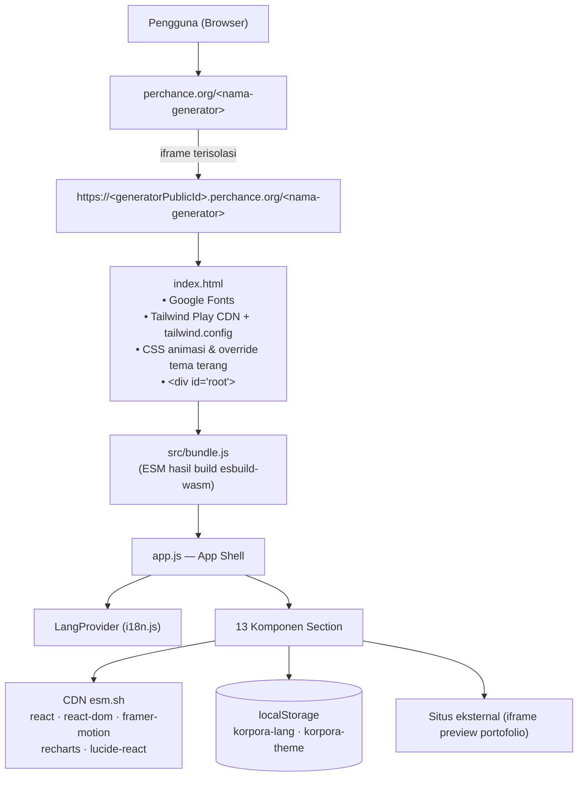
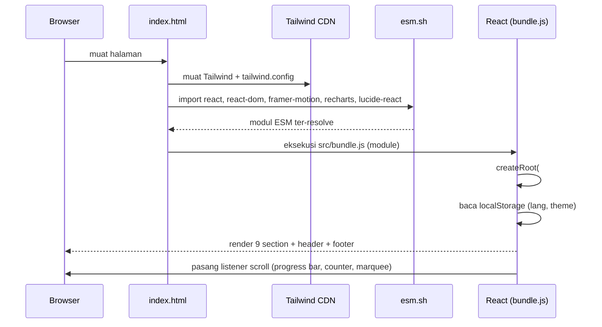
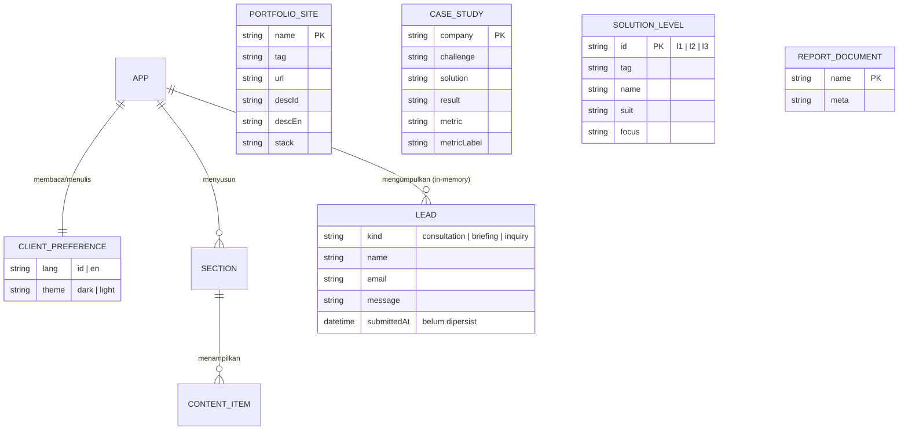

# LAPORAN AKHIR KERJA PRAKTIK (KP)

## Korpora Web Atelier — Landing Page Solusi Website Enterprise

| Field | Nilai |
|---|---|
| Nama Mahasiswa | `[NAMA_MAHASISWA]` |
| NIM | `[NIM]` |
| Universitas / Program Studi | `[UNIVERSITAS]` / `[PRODI]` |
| Perusahaan / Divisi | `[NAMA_PERUSAHAAN]` — `[DIVISI]` |
| Periode KP | `[TANGGAL_MULAI]` – `[TANGGAL_SELESAI]` |
| Pembimbing Lapangan | `[NAMA_PEMBIMBING_LAPANGAN]` |
| Pembimbing Kampus | `[NAMA_PEMBIMBING_KAMPUS]` |
| Preview | `https://perchance.org/[nama-generator]` |
| Versi Dokumen | 1.0 — `[TANGGAL_DOKUMEN]` |

> **Cara melengkapi:** ganti semua penanda `[…]` di atas (dan di seluruh dokumen) dengan data Anda.

---

## Daftar Isi

1. [Bab 1 — Laporan Ringkas / Executive Summary](#bab-1)
2. [Bab 2 — Daftar Project & Modul](#bab-2) — *termasuk daftar 15 link demo website portofolio (§2.4)*
3. [Bab 3 — Dokumentasi Arsitektur & Perancangan](#bab-3)
4. [Bab 4 — Panduan Instalasi & Deployment (Setup Guide)](#bab-4)
5. [Bab 5 — Hasil Pengujian (Testing & Validation)](#bab-5)
6. [Bab 6 — Catatan Pengembangan Mendatang (Future Improvements / Known Bugs)](#bab-6)

---

# Bab 1 — Laporan Ringkas / Executive Summary

## 1.1 Latar Belakang

`[NAMA_PERUSAHAAN]` bergerak di bidang jasa **arsitektur & pengembangan website kelas korporat**. Segmen pelanggan perusahaan adalah *large enterprise*, **konglomerasi**, dan **holding group** — organisasi yang sering memiliki banyak anak perusahaan, portal *Investor Relations* (IR), laporan tahunan/ESG, serta kewajiban tata kelola (*Good Corporate Governance*/GCG) dan kepatuhan (SOC 2, ISO 27001, GDPR, WCAG).

Masalah yang ditemukan di lapangan sebelum project ini:

1. **Materi sales tidak "berbicara bahasa korporat".** Proposal/downloadable deck yang ada bersifat teknis (portofolio desain, fitur teknis), sementara pengambil keputusan di perusahaan besar adalah direksi, *board*, dan tim *procurement* yang menilai sesuatu dari sisi **tata kelola, kepatuhan, keamanan, dan reputasi**, bukan sekadar estetika.
2. **Bukti kompetensi tidak terkumpul dalam satu tempat.** Portofolio tersebar, tidak ada satu halaman yang secara meyakinkan memetakan *"masalah organisasi Anda → arsitektur yang kami bangun → hasil terukur"*.
3. **Belum ada kanal akuisisi mandiri (self-serve).** Calon klien harus menghubungi via email biasa; tidak ada jalur untuk meminta *quote*, *booking briefing*, atau *pengajuan RFP* langsung dari website, dan tidak ada *content center* (laporan tahunan, katalog, ringkasan finansial) yang bisa diakses tanpa negosiasi.
4. **Tim marketing perlu mengubah konten tanpa developer.** Tidak ada satu tempat untuk melihat struktur penawaran (level kompleksitas organisasi, scope kerja, paket, add-on) yang bisa dipakai ulang sebagai *source of truth* sales.

## 1.2 Tujuan / Problem Statement

Project KP ini bertujuan membangun **satu landing page B2B yang menjadi "digital sales room"** untuk penjualan jasa website enterprise. Secara spesifik, problem statement yang diselesaikan:

> **PS-1** — Bagaimana menyampaikan nilai jasa arsitektur website ke *stakeholder* perusahaan besar dalam bahasa **governance, compliance, dan skala bisnis** (bukan bahasa kode), dalam **satu halaman yang bisa dipakai sales sebagai rujukan tunggal**?

> **PS-2** — Bagaimana menyediakan **jalur konversi mandiri** (konsultasi, permintaan quote, pengajuan RFP/pengadaan) langsung dari halaman, tanpa bergantung pada percakapan email manual?

> **PS-3** — Bagaimana menyajikan **bukti & materi pendukung** (portofolio live, studi kasus Challenge→Solution→Result, pusat laporan tahunan/ESG, FAQ kepercayaan) yang meyakinkan *board* dan tim kepatuhan untuk melangkah ke tahap negosiasi?

> **PS-4** — Bagaimana membuat halaman tersebut **mudah dikelola** (dwibahasa, tema, konten terstruktur) sehingga tim marketing non-teknis dapat memeliharanya?

## 1.3 Tujuan Project (Deliverable)

| Kode | Tujuan | Status |
|---|---|---|
| G-1 | Landing page responsif satu halaman dengan narasi enterprise (GCG, kepatuhan, multi-entity) | ✅ Selesai |
| G-2 | Sistem **dwibahasa (ID/EN)** dengan prioritas Bahasa Indonesia, persisten | ✅ Selesai |
| G-3 | **Tema gelap/terang** yang bisa diganti pengguna dan disimpan | ✅ Selesai |
| G-4 | Halaman portofolio berisi **preview live** dari karya yang sudah dirilis | ✅ Selesai |
| G-5 | **Widget interaktif**: pusat laporan/PDF + kanal *whistleblowing* & pengadaan | ✅ Selesai |
| G-6 | **Jalur lead capture** (modal konsultasi, booking briefing, form pengadaan) | ✅ Selesai (validasi klien) |
| G-7 | Struktur penawaran: pilar enterprise, level kompleksitas organisasi, scope/paket, add-on, FAQ | ✅ Selesai |
| G-8 | Integrasi pengiriman lead ke backend/CRM | ⛔ Belum (lihat Bab 6) |
| G-9 | Unduhan PDF asli dari *Report Center* | ⛔ Belum (saat ini hanya state UI) |

## 1.4 Scope (Batasan) Fitur

**Termasuk dalam scope KP:**

- Frontend SPA React (satu halaman, *scrolling sections*).
- Dwibahasa ID/EN untuk seluruh *copy* utama.
- Tema gelap/terang dengan mode gelap sebagai default.
- Komponen visual interaktif: dropdown navigasi, drawer mobile, akordeon FAQ, grafik finansial (Recharts), *marquee* kapabilitas, kartu portofolio dengan *live iframe*, *counter* angka animasi.
- Formulir *client-side* dengan validasi HTML5 dan tampilan status sukses: (a) modal konsultasi, (b) booking briefing, (c) *whistleblowing*/pengadaan.

**Di luar scope KP (secara eksplisit):**

- **Backend, REST/GraphQL API, database** — project ini murni *static frontend*. Data konten adalah konstanta di dalam kode.
- **Pengiriman email/notifikasi nyata** — formulir hanya menampilkan status sukses di UI; tidak ada request jaringan keluar.
- **Autentikasi, otorisasi, panel admin/CMS** — konten diubah dengan mengedit kode.
- **Unduhan file PDF asli** — tombol *Report Center* hanya mengubah state (belum mengunduh berkas).
- **Analytics/pelacakan pengunjung, cookie consent.**
- Pengujian otomatis (unit/E2E) — pengujian dilakukan manual + verifikasi DOM programatik (lihat Bab 5).
- Deployment ke domain produksi milik perusahaan — saat ini berjalan sebagai generator Perchance (lihat Bab 4).

## 1.5 Batasan & Asumsi Teknis

- Aplikasi dijalankan di **browser** (`browser-only`); tidak ada proses server milik sendiri. Karena tidak bisa memakai *import map* di lingkungan target, **JSX wajib dikompilasi** ke satu file `bundle.js` memakai `esbuild-wasm`.
- Seluruh *dependency* pihak ketiga dimuat dari CDN **esm.sh** dengan versi *pinned*; halaman membutuhkan koneksi internet saat pertama kali dimuat.
- Versi React **wajib dipin di 18.3.1** pada setiap URL esm.sh; jika tidak, esm.sh menarik React 19 dan `react-dom@18` gagal (`useContext` pada `null`).
- Konten (metrik, studi kasus, angka statistik) saat ini adalah **data contoh untuk keperluan demo** dan harus divalidasi tim marketing/legal sebelum publikasi produksi.
- Font dimuat dari Google Fonts; ada *fallback* font sistem bila gagal.

## 1.6 Hasil Singkat

- 1 project, **16 file sumber** di `src/` (14 komponen di `src/components/` + `app.js` + `i18n.js`), bundle produksi **~95 KB**.
- 9 section fungsional dengan navigasi *anchor*: `#top`, `#portfolio`, `#pillars`, `#templates`, `#laporan`, `#studi`, `#paket`, `#faq`, `#quote`.
- Pengujian manual 17 skenario: **15 lulus**, **2 tidak lulus** (CTA hero tidak berfungsi; modal tidak menutup dengan tombol Escape) — detail dan perbaikannya ada di Bab 5 & 6.
- Detail hasil teknis lengkap: lihat Bab 3 (arsitektur) dan Bab 5 (pengujian).

---

# Bab 2 — Daftar Project & Modul

## 2.1 Inventarisasi Project

Selama masa KP, **satu project** digarap:

| # | Project | Deskripsi | Teknologi Utama | Status |
|---|---------|-----------|-----------------|--------|
| P-1 | **Korpora Web Atelier — Landing Page Solusi Website Enterprise** | SPA satu halaman sebagai *digital sales room* untuk menjual jasa arsitektur/pengembangan website ke korporasi, konglomerasi, dan holding group. Mencakup presentasi nilai (pilar, level solusi, case study, FAQ), portofolio live, pusat laporan, dan tiga jalur *lead capture*. | React 18, Tailwind CSS, Framer Motion, Recharts, lucide-react, esbuild-wasm | Selesai (frontend) |

**Struktur berkas project:**

```
main.pjs                  # metadata SEO generator (title/description/tags)
index.html                # shell: font, Tailwind Play CDN, tema, animasi, #root
src/
  app.js                  # entry point aplikasi (App shell)
  i18n.js                 # konteks bahasa ID/EN
  bundle.js               # HASIL BUILD (artefak, jangan diedit manual)
  favicon.svg             # ikon generator
  components/             # 14 komponen UI (lihat 2.2)
  README.md               # catatan arsitektur untuk developer
```

**Ukuran:** ±87 KB kode sumber (JS/JSX) → **bundle produksi ±95 KB** (`src/bundle.js` = 97.451 byte, sudah termasuk dep eksternal tidak ikut ter-bundle).

## 2.2 Daftar Modul / Sub-Fitur

### A. Modul Infrastruktur Aplikasi

| # | Modul | Berkas | Ukuran | Fungsi Utama |
|---|-------|--------|--------|--------------|
| M-01 | **App Shell** | `src/app.js` | 2,3 KB | Membuat root React, memegang state global **tema** (`korpora-theme`) dan **modal konsultasi**, menyusun urutan seluruh section, membungkus aplikasi dengan `LangProvider`. |
| M-02 | **i18n Provider** | `src/i18n.js` | 0,7 KB | `LangProvider` + hook `useLang()`. Menyimpan bahasa aktif (`id`\|`en`) ke `localStorage['korpora-lang']`, default `id`. |
| M-03 | **UI Primitives** | `src/components/ui.jsx` | 4,9 KB | Kumpulan komponen dasar yang dipakai ulang: `MotionReveal`, `Reveal`, `AnimatedNumber` (counter angka), `Button` (6 varian), `Badge`, `Kicker`, `SectionHeading`, `GlassCard`. |

### B. Modul Section Halaman (urut tampil)

| # | Modul | Berkas | Anchor | Fungsi Utama |
|---|-------|--------|--------|--------------|
| M-04 | **Header & Navigasi** | `EnterpriseHeader.jsx` | — | Header *fixed*: logo `KORPORA`, dropdown **Solusi** (3 entri), toggle bahasa ID/EN, toggle tema, badge SOC2/GDPR, tombol CTA (versi drawer), **bar progres scroll**, drawer mobile < `lg`. Mengekspor `Logo` untuk dipakai Footer. |
| M-05 | **Hero** | `EnterpriseHero.jsx` | `#top` | Positioning line, badge, headline gradien, 2 CTA, 3 *trust checkmark*, dan **mockup "browser window"** berisi `FinancialPreview` (grafik area **Recharts**) + 3 kartu KPI + tombol unduh laporan. |
| M-06 | **Capability Marquee** | `CapabilityMarquee.jsx` | — | Pita berjalan 12 kapabilitas enterprise (CSS *marquee*, pause saat hover). |
| M-07 | **Portfolio** | `Portfolio.jsx` | `#portfolio` | 15 kartu website klien dengan **pratinjau `iframe` live** (di-*scale* 0.34), badge "Live", tag stack, dan tombol **Demo** yang membuka situs di tab baru. **Daftar lengkap 15 URL demo: §2.4.** |
| M-08 | **Pilar Enterprise** | `BenefitPillars.jsx` | `#pillars` | Strip 4 statistik dengan **counter animasi** + 4 pilar nilai: GCG, B2B/Investor, Visibilitas & aksesibilitas, Produktivitas & multi-brand. |
| M-09 | **Showcase Level Solusi** | `CorporateShowcase.jsx` | `#templates` | 3 level kompleksitas organisasi (L1 B2B Industrial / L2 Holding multi-subsidiary / L3 Publik Tbk & ESG) dengan mockup mini, fokus, dan stack. |
| M-10 | **Widget Interaktif** | `EnterpriseWidgets.jsx` | `#laporan` | Dua widget: **Report Center** (4 laporan PDF dengan state unduh) dan form **Whistleblowing & Pengadaan** (nama, email, pesan) dengan status sukses. |
| M-11 | **Mini Case Studies** | `CaseStudies.jsx` | `#studi` | 2 kartu studi kasus format **Tantangan → Solusi → Hasil** dengan metrik utama (−55% biaya maintenance; +200% closing B2B). |
| M-12 | **Scope & Paket** | `ScopePaket.jsx` | `#paket` | 4 fase implementasi + 3 add-on opsional (integrasi ERP/CRM, server dedicated, SLA maintenance). |
| M-13 | **FAQ Korporat** | `EnterpriseFaq.jsx` | `#faq` | Akordeon 3 pertanyaan kepercayaan (NDA, kepemilikan source code, multi-bahasa & audit) — mode *single-open*, animasi `AnimatePresence`. |
| M-14 | **CTA & Booking** | `EnterpriseCta.jsx` | `#quote` | Banner gradien dengan form booking briefing (nama + email), daftar slot waktu, dan badge kepatuhan SOC 2 / ISO 27001 / GDPR / WCAG AA. |
| M-15 | **Footer** | `Footer.jsx` | — | Footer 6 kolom: profil studio + 3 kolom tautan (Solusi/Teknologi/Perusahaan), kontak, dan hak cipta bertahun dinamis. |
| M-16 | **Modal Konsultasi** | `EnterpriseModal.jsx` | — | Modal *overlay* untuk meminta konsultasi (input email), menutup via backdrop; menampilkan status sukses. |

### C. Modul Build & Aset

| # | Modul | Berkas | Fungsi |
|---|-------|--------|--------|
| M-17 | **Shell HTML & Konfigurasi Tema** | `index.html` | Memuat Google Fonts + Tailwind Play CDN, mendefinisikan `tailwind.config` (warna `obsidian`, `electric`, `corporate`; font `Syne`/`Space Grotesk`/`Inter`/`JetBrains Mono`; keyframes), ~30 animasi CSS, dan seluruh *override* CSS tema terang (`.light`, `.dark-window`). |
| M-18 | **Metadata SEO** | `main.pjs` | `$meta` generator: title, description, tags. |
| M-19 | **Build Pipeline** | `src/bundle.js` | Artefak hasil kompilasi JSX→ESM memakai `esbuild-wasm`; `index.html` memuatnya sebagai `<script type="module">`. **Tidak diedit manual** — sumbernya ada di `src/*.jsx`. |

## 2.3 Fitur Silang-Modul (Cross-cutting Features)

| Fitur | Implementasi | Dampak |
|---|---|---|
| **Dwibahasa ID/EN** | `useLang()` + peta string per komponen; toggle di header; persisten di `localStorage` | Seluruh *copy* utama punya versi ID & EN; bahasa ID jadi default |
| **Tema terang/gelap** | class `.light` pada `<html>` + blok CSS *override* besar di `index.html`; mockup tetap gelap lewat `.dark-window` | Nyaman dibaca di ruangan terang; mockup tetap tampil "seperti screenshot" |
| **Animasi** | CSS keyframes (`korpFloat`, `korpMarquee`, …), `AnimatedNumber`, `AnimatePresence` untuk FAQ | Kesan premium; dihormati `prefers-reduced-motion` |
| **Responsif** | Tailwind *mobile-first*, breakpoint `lg` untuk drawer | Tanpa *overflow* horizontal pada 390 px maupun 1440 px |
| **Aksesibilitas dasar** | `aria-label` pada tombol ikon, `aria-hidden` untuk elemen dekoratif, kontras diuji manual | Fondasi menuju WCAG 2.1 AA |


## 2.4 Daftar Link Website Portofolio (Preview & Demo Live)

Modul **M-07 Portfolio** (`src/components/Portfolio.jsx`) menampilkan **15 website** hasil arsitektur studio dalam bentuk kartu. Setiap kartu menyimpan **satu URL live** yang dipakai dua kali sekaligus:

- sebagai **sumber `iframe` pratinjau** (`src={url}`, di-*scale* `0.34`, `loading="lazy"`, `pointerEvents: none`) sehingga pengunjung melihat tampilan situs asli tanpa harus membukanya, dan
- sebagai **target tombol "Demo"** (serta *overlay* kartu) yang membuka situs di tab baru dengan `target="_blank" rel="noopener noreferrer"`.

Seluruh tautan tertanam pada konstanta `SITES`, dan berikut **daftar lengkap 15 URL demo** yang saat ini aktif:

| # | Nama Situs | Kategori / Tag | URL Demo (Live) | Stack |
|---|-----------|----------------|-----------------|-------|
| 1 | **Aetheria** | Creative Tech Studio | https://aetheria-lac.vercel.app/ | React, Next.js, AI/ML, i18n |
| 2 | **Aetheris** | Corporate Creative Tech | https://comporate-oo1m.vercel.app/ | React 18, Framer Motion, Recharts |
| 3 | **Aetheris Quantum** | Quantum & Autonomous | https://komtrorate.vercel.app/ | Next.js, 3D / WebGL, Real-time |
| 4 | **Valence** | Intelligent Systems | https://corrcoorr.vercel.app/ | React, Spatial UI, AI |
| 5 | **Valence Dynamics** | Deep Tech / R&D | https://porrtat.vercel.app/ | Next.js, Data Viz, Security |
| 6 | **Nexaris Global** | Autonomous Systems | https://corrp1.vercel.app/ | React 18, Edge, i18n |
| 7 | **Kyron** | Digital Flagship | https://corrpp2.vercel.app/ | React 18, Framer Motion, SEO |
| 8 | **Synova Global** | Strategic Transformation | https://corrpp3.vercel.app/ | Next.js, Headless CMS, Analytics |
| 9 | **Aethis Global** | Applied Tech | https://croopp4.vercel.app/ | React, Dashboards, Cloud |
| 10 | **Aetheron Dynamics** | Digital HQ | https://croopp5.vercel.app/ | Next.js, 3D / WebGL, Edge |
| 11 | **Kordex** | Digital Architecture | https://croopp6.vercel.app/ | React 18, Spatial UI, Cloud |
| 12 | **Aetheron Command** | Command Center | https://corrp7.vercel.app/ | Recharts, Real-time, Security |
| 13 | **Valence Kinetic** | Kinetic Computing | https://croopp8.vercel.app/ | React, Animations, AI |
| 14 | **Aetheris Enterprise** | Enterprise Systems | https://croopp9.vercel.app/ | React 18, Framer Motion, SEO |
| 15 | **Aetheris Labs** | Future Lab / R&D | https://croopp10.vercel.app/ | Next.js, Data Viz, i18n |

| Ringkasan | Nilai |
|---|---|
| Jumlah tautan | **15** (semuanya berupa URL `https` aktif) |
| Domain | `*.vercel.app` (15/15) |
| Pola tautan | Semua kartu memakai *link* yang sama untuk `iframe` pratinjau **dan** tombol **Demo** |
| Sumber data | Array `SITES` di `src/components/Portfolio.jsx` (lihat Bab 3 §3.4 untuk skema `SITES`) |
| Deskripsi kartu | `descId` (Indonesia) & `descEn` (Inggris) per situs — mengikuti *toggle* bahasa |

> **Cara mengganti / menambah link:** ubah nilai `url` (atau tambahkan objek baru) pada array `SITES`, lalu **build ulang** `src/bundle.js` (lihat Bab 4). Pratinjau `iframe` dan tombol **Demo** otomatis mengikuti, dan tabel di atas perlu diperbarui manual agar dokumen tetap sinkron dengan kode.
>
> **Catatan pengujian:** 15 `iframe` ini adalah beban jaringan terbesar pada halaman dan bergantung pada situs pihak ketiga (bisa kosong jika `X-Frame-Options`/CSP memblokir). Lihat Bab 5 (T-11) dan Bab 6 (§6.2, P2-2).

---

# Bab 3 — Dokumentasi Arsitektur & Perancangan

## 3.1 System Architecture / Tech Stack

### 3.1.1 Bahasa & Framework

| Lapisan | Teknologi | Versi | Keterangan |
|---|---|---|---|
| Bahasa | JavaScript (ES2022) | — | Sumber ditulis dalam **JSX**; dikompilasi ke ESM |
| Markup | HTML5 | — | `index.html` (shell) |
| Styling | CSS3 | — | Ditulis sebagai *utility class* Tailwind + keyframes CSS kustom |
| Framework UI | **React** | **18.3.1** | Wajib pinned (lihat catatan di 3.1.4) |
| Renderer DOM | **react-dom** | **18.3.1** | Digunakan via `/client` |
| Build tool | **esbuild-wasm** | 0.21.5 | Dijalankan sekali untuk menghasilkan `bundle.js` |
| CSS framework | **Tailwind CSS** (Play CDN) | v3 (runtime, via `cdn.tailwindcss.com`) | Konfigurasi kustom di `index.html` |
| Animasi | **Framer Motion** | **11.18.2** | Akordeon FAQ, transisi elemen, counter angka |
| Grafik | **Recharts** | **2.x** (pinned major) | Grafik area pada mockup finansial Hero |
| Ikon | **lucide-react** | **0.469.0** | Seluruh ikon UI |
| Font | Google Fonts | — | Syne, Space Grotesk, Inter, JetBrains Mono |
| Runtime host | Perchance | — | Halaman dijalankan dalam *iframe* |

### 3.1.2 Database / Penyimpanan

| Sistem | Teknologi | Versi | Penggunaan |
|---|---|---|---|
| Database relasional | **Tidak ada** | — | Project murni frontend; tidak ada server DB |
| Penyimpanan klien | **`localStorage`** | Web Storage API | Hanya 2 preferensi pengguna (bahasa, tema) |
| Sumber konten | **Konstanta JS** | — | Seluruh konten (portofolio, pilar, FAQ, dll.) *hard-coded* di dalam komponen |

> **Catatan penting:** bagian *Database Structure* pada template laporan (ERD/skema tabel) di project ini dipetakan menjadi **skema data statis + skema preferensi klien** pada bagian 3.3. Tidak ada tabel SQL/NoSQL karena tidak ada backend.

### 3.1.3 Library / Tool Pendukung

| Tool | Fungsi |
|---|---|
| `esm.sh` | CDN modul ESM; seluruh dependency eksternal dipin ke versi tertentu |
| `cdn.tailwindcss.com` | Tailwind Play CDN (JIT di browser) — **hanya untuk pengembangan/prototipe** |
| Google Fonts | Penyediaan 4 keluarga font |
| Perchance platform | Hosting halaman + manajemen generator |

### 3.1.4 Catatan Kompatibilitas Kritis

1. **React harus dipin 18.3.1** di setiap URL esm.sh (`?deps=react@18.3.1,react-is@18.3.1`). Bila tidak, esm.sh akan menarik **React 19** sebagai peer, sementara `react-dom@18` tetap dipakai → error runtime `useContext` pada `null` (aplikasi blank).
2. **Tailwind Play CDN memunculkan peringatan** `cdn.tailwindcss.com should not be used in production`. Untuk produksi disarankan build Tailwind via CLI/PostCSS (lihat Bab 4).
3. **JSX tidak bisa dijalankan browser.** Tidak ada *import map* di lingkungan target, karena itu seluruh JSX dikompilasi ke satu `bundle.js`.

---

## 3.2 Arsitektur Sistem

### 3.2.1 Diagram Arsitektur



### 3.2.2 Alur Render (Sequence)



### 3.2.3 Pola Arsitektur

| Aspek | Pendekatan |
|---|---|
| Struktur | **Single Page Application (SPA)**, *section-based scrolling* dengan navigasi *anchor* |
| Komposisi | *Component-based*; satu berkas per section, komponen dasar dipakai ulang dari `ui.jsx` |
| State global | React Context untuk **bahasa** (`LangProvider`/`useLang`); state lokal `useState` untuk tema & modal di `app.js` |
| State lokal | `useState` per komponen (FAQ terbuka, form terisi, status sukses) |
| Persistensi | `localStorage` (2 kunci), dibungkus `try/catch` agar aman pada mode privat |
| Styling | Utility-first (Tailwind) + kelas kustom (`.dark-window`, `.anim-*`, `.korp-marquee`) untuk pengecualian |
| Konten | Konstanta array/objek per komponen; versi ID & EN berdampingan (`{ id: {...}, en: {...} }`) |
| i18n | Kamus *inline* per komponen, dipilih lewat `lang === 'en' ? … : …` |

---

## 3.3 Struktur Data (Pengganti ERD)

Karena project tidak memakai database, "skema tabel" di sini adalah **skema data klien**: (a) dua entitas *persisten* di `localStorage`, (b) koleksi konten statis, dan (c) tiga entitas **virtual** (data formulir yang saat ini hanya hidup di memori).

### 3.3.1 ERD (logis)



### 3.3.2 Entitas Persisten — `localStorage`

| Key | Tipe | Nilai valid | Default | Ditulis oleh | Dibaca oleh |
|---|---|---|---|---|---|
| `korpora-lang` | string | `"id"` \| `"en"` | `"id"` | `i18n.js` → `LangProvider` | `LangProvider` (state awal) |
| `korpora-theme` | string | `"dark"` \| `"light"` | `"dark"` | `app.js` (efek samping perubahan state) | `getInitialTheme()` di `app.js` |

Penulisan selalu dibungkus `try/catch` — bila gagal (mis. *storage* diblokir), aplikasi tetap berjalan dengan default.

### 3.3.3 Koleksi Konten Statis

| Koleksi (konstanta) | Berkas | Field | Jumlah item |
|---|---|---|---|
| `SITES` | `Portfolio.jsx` | `name, tag, url, descId, descEn, stack[]` | 15 — **daftar URL lengkap: Bab 2 §2.4** |
| `STATS_BASE` | `BenefitPillars.jsx` | `to, prefix, suffix, label` | 4 (per bahasa) |
| `PILLARS_BASE` | `BenefitPillars.jsx` | `icon, accent, line, id{title,desc}, en{title,desc}` | 4 |
| `LEVELS_BASE` | `CorporateShowcase.jsx` | `id, icon, accent, line, num, tag, idT{…}, enT{…}, stack[]` | 3 |
| `CASES_BASE` | `CaseStudies.jsx` | `icon, accent, line, id{…}, en{…}` | 2 |
| `SCOPE_BASE` | `ScopePaket.jsx` | `icon, num, id{t,d}, en{t,d}` | 4 |
| `ADDON_BASE` | `ScopePaket.jsx` | `icon, t, d` | 3 (per bahasa) |
| `FAQ_BASE` | `EnterpriseFaq.jsx` | `icon, id{q,a}, en{q,a}` | 3 |
| `reports` | `EnterpriseWidgets.jsx` | `icon, name, meta` | 4 (per bahasa) |
| `SERIES` | `EnterpriseHero.jsx` | `label, color, growth, id{name,unit}, en{name,unit}, data[{l,v,s}]` | 2 seri × 6 titik |
| `SOLUTIONS_DATA` | `EnterpriseHeader.jsx` | `icon, name, desc, tag, href` | 3 (per bahasa) |
| `COLUMNS_BASE` | `Footer.jsx` | `title, links[]` | 3 (per bahasa) |

### 3.3.4 Entitas Virtual (Formulir — belum dipersist)

| Entitas | Komponen | Field UI | Field diterima state | Persistensi |
|---|---|---|---|---|
| `CONSULTATION_BOOKING` | `EnterpriseCta.jsx` | `name`, `email` | `{name, email}` | ❌ hanya `useState` → tampil sukses, tidak dikirim |
| `INQUIRY` (whistleblowing/pengadaan) | `EnterpriseWidgets.jsx` | `name`, `email`, `message` | tidak disimpan sama sekali | ❌ hanya flag `sent` |
| `MODAL_CONSULT` | `EnterpriseModal.jsx` | `email` | `{email}` | ❌ hanya `useState` |

> Untuk whistleblowing, **jangan** pernah menyimpan identitas pelapor secara sembarangan; lihat desain kanal anonim pada Bab 6 §6.3.

---

## 3.4 API Documentation

> **Status:** project ini **belum memiliki API HTTP apa pun**. Bagian 3.4.1–3.4.3 mendokumentasikan "API" yang benar-benar ada saat ini (internal, penyimpanan, dan modul eksternal). Bagian 3.4.4 adalah **kontrak API yang diusulkan** untuk backend pada fase berikutnya.

### 3.4.1 Internal JS API (komponen & hook)

| API | Tipe | Signature | Deskripsi |
|---|---|---|---|
| `useLang()` | hook | `() => { lang: 'id'\|'en', setLang(l) }` | Mengambil & mengubah bahasa aktif. Fallback: `{lang:'id', setLang:noop}` bila dipakai di luar provider. |
| `LangProvider` | komponen | `<LangProvider>{children}</LangProvider>` | Menyediakan konteks bahasa + persistensi ke `localStorage`. |
| `AnimatedNumber` | komponen | `{ to:number, duration?:1.8, prefix?:string, suffix?:string, decimals?:0, className?:string }` | Counter angka animasi (`framer-motion` `animate`); fallback ke nilai akhir setelah 1,2 s bila belum masuk viewport. |
| `Button` | komponen | `{ variant?:'primary'\|'cyan'\|'ghost'\|'outline'\|'white'\|'darkOnLight', size?:'sm'\|'md'\|'lg'\|'xl', as?:'button'\|'a', icon?:node, ...rest }` | Tombol serbaguna (`forwardRef`), mendukung `as="a"` untuk tautan. |
| `MotionReveal` | komponen | `{ children, delay?, y?, className?, style?, section?:bool }` | Pembungkus blok section (saat ini **wrapper statis**, lihat Bab 6 §6.2). |
| `Reveal` | komponen | `{ children, delay?, className?, as? }` | Pembungkus ringan (statis). |
| `Badge` | komponen | `{ tone?:'default'\|'accent'\|'cyan'\|'glow' }` | Label kecil bergaya pil. |
| `Kicker` | komponen | `{ children }` | Teks *eyebrow* dengan garis gradien. |
| `SectionHeading` | komponen | `{ kicker, title, desc?, align?:'left'\|'center' }` | Blok judul section standar. |
| `GlassCard` | komponen | `{ children, hover?:bool, className? }` | Kartu *glassmorphism* dengan efek hover. |
| `Logo` | komponen | `{ className? }` | Logo `KORPORA` (dipakai Header & Footer). |
| `EnterpriseModal` | komponen | `{ open:bool, onClose:fn }` | Modal konsultasi (render `null` bila `open=false`). |
| `EnterpriseHeader` | komponen | `{ dark:bool, toggleDark:fn, onConsult:fn }` | Header; `onConsult` **hanya terpakai di drawer mobile**. |
| `EnterpriseHero` | komponen | `{ onConsult:fn }` | Hero; saat ini **tidak menerima** `onConsult` di `app.js` (bug — Bab 6 §6.1). |

### 3.4.2 Storage API

| Operasi | Kunci | Nilai | Catatan |
|---|---|---|---|
| Baca | `korpora-lang` | `"id"`/`"en"` | `i18n.js` — inisialisasi state |
| Tulis | `korpora-lang` | `"id"`/`"en"` | saat toggle bahasa |
| Baca | `korpora-theme` | `"dark"`/`"light"` | `app.js` — `getInitialTheme()` |
| Tulis | `korpora-theme` | `"dark"`/`"light"` | efek `useEffect` saat tema berubah |

### 3.4.3 External Module API (CDN)

| Modul | URL (dipin) | Dipakai di |
|---|---|---|
| react | `https://esm.sh/react@18.3.1` | semua komponen |
| react-dom/client | `https://esm.sh/react-dom@18.3.1/client` | `app.js` |
| jsx-runtime | `https://esm.sh/react@18.3.1/jsx-runtime` | hasil kompilasi JSX |
| framer-motion | `https://esm.sh/framer-motion@11.18.2?deps=react@18.3.1,react-is@18.3.1` | `ui.jsx`, `EnterpriseHero`, `EnterpriseFaq` |
| recharts | `https://esm.sh/recharts@2?deps=react@18.3.1,react-is@18.3.1` | `EnterpriseHero` |
| lucide-react | `https://esm.sh/lucide-react@0.469.0?deps=react@18.3.1` | hampir semua komponen |
| Tailwind | `https://cdn.tailwindcss.com` | `index.html` |

### 3.4.4 Kontrak API yang Diusulkan (belum diimplementasikan)

Berikut rancangan endpoint agar frontend bisa disambungkan ke backend/CRM tanpa mengubah struktur data di sisi UI. **Semua endpoint belum ada.**

**a) `POST /api/v1/leads/consultation`** — dari modal konsultasi & booking briefing

```json
// Request
{
  "source": "modal_consultation",
  "name": "Budi Santoso",
  "email": "budi@perusahaan.co.id",
  "company": "PT Contoh Tbk",
  "slot": "2026-09-21T09:30:00+07:00",
  "lang": "id"
}
// Response 201
{ "id": "lead_8f3c1a", "status": "queued", "message": "Tim kami akan menghubungi Anda." }
```

**b) `POST /api/v1/inquiries`** — kanal *whistleblowing*/pengadaan (harus dirancang **anonim & terenkripsi**)

```json
// Request
{ "type": "procurement|concern", "message": "…", "contact": null, "attachments": [] }
// Response 202
{ "receipt": "WB-2026-0007", "receivedAt": "2026-09-17T10:12:00+07:00" }
```

**c) `GET /api/v1/reports`** — daftar dokumen *Report Center*

```json
// Response 200
{
  "items": [
    { "id": "ar-fy25", "title": "Annual Report FY25", "fileUrl": "https://…/ar-fy25.pdf", "size": "8.4 MB", "lang": ["id","en"] }
  ]
}
```

**d) `GET /api/v1/portfolio`** — daftar situs portofolio (menggantikan `SITES` hard-coded)

```json
{
  "items": [
    { "name": "Aetheria", "tag": "Creative Tech Studio", "url": "https://…", "stack": ["React","Next.js"], "desc": { "id": "…", "en": "…" } }
  ]
}
```

**Kebutuhan non-fungsional:** proteksi bot (honeypot / CAPTCHA), *rate limit* per IP, validasi email, CSP, dan pencatatan audit untuk kanal whistleblowing.

---

## 3.5 Design System & Perancangan Tampilan

### 3.5.1 Palet Warna (didefinisikan di `tailwind.config`)

| Token | Hex | Penggunaan |
|---|---|---|
| `obsidian` | `#0B0F19` | Latar utama (tema gelap) |
| `obsidian2` | `#0E1424` | Panel/mockup |
| `obsidian3` | `#131B2E` | Elemen dalam mockup |
| `electric` | `#06B6D4` | Aksen sekunder (cyan) |
| `corporate` | `#4F46E5` | Aksen utama (indigo) |

Palet semantik tambahan memakai bawaan Tailwind (`slate`, `indigo`, `cyan`, `emerald`, `violet`).

### 3.5.2 Tipografi

| Peran | Font | Kelas Tailwind |
|---|---|---|
| Heading | Syne (500–800) | `font-heading` |
| Display/angka | Space Grotesk (400–700) | `font-display` |
| Body | Inter (400–700) | `font-sans` (default) |
| Meta/mono | JetBrains Mono (400–600) | `font-mono` |

### 3.5.3 Prinsip Desain

1. **"Code is cheap, governance is expensive."** Narasi utama bukan fitur teknis, melainkan tata kelola, kepatuhan, dan skala.
2. **Mockup sebagai bukti.** Kotak gelap bergaya jendela browser (`.dark-window`) menampilkan "produk" — grafik finansial, portal IR — sekaligus tetap terbaca di tema terang.
3. **Kepadatan enterprise.** Grid rapi, label mono huruf besar sebagai penanda kredibilitas teknis.
4. **Gerak yang tenang.** Animasi halus (`float`, `marquee`, `scan`) untuk kesan premium, dimatikan saat `prefers-reduced-motion`.

### 3.5.4 Peta Section → Anchor

| Section | Anchor | Modul |
|---|---|---|
| Hero | `#top` | M-05 |
| Portfolio | `#portfolio` | M-07 |
| Pilar Enterprise | `#pillars` | M-08 |
| Level Solusi | `#templates` | M-09 |
| Report Center & Whistleblowing | `#laporan` | M-10 |
| Case Studies | `#studi` | M-11 |
| Scope & Paket | `#paket` | M-12 |
| FAQ | `#faq` | M-13 |
| CTA / Booking | `#quote` | M-14 |

---

## 3.6 Build Pipeline

```
src/*.jsx  ──(esbuild-wasm: loader jsx, jsx:automatic, format esm)──▶  src/bundle.js  ──▶  index.html <script type="module">
```

- Impor *bare* (`react`, `react-dom/client`, `framer-motion`, `recharts`, `lucide-react`) dibiarkan **external** → diselesaikan browser lewat URL esm.sh.
- Impor relatif (`./ui.jsx`, `../i18n.js`) diselesaikan plugin esbuild dengan *namespace* `ws` (membaca berkas workspace) dan loader `jsx`.
- **Setiap kali berkas di `src/*.jsx` diubah, `bundle.js` WAJIB dibangun ulang**, jika tidak perubahan tidak akan tampil di browser.

---

# Bab 4 — Panduan Instalasi & Deployment (Setup Guide)

## 4.1 Prasyarat Sistem (Prerequisites)

| Kebutuhan | Versi minimum | Diperlukan untuk |
|---|---|---|
| **Node.js** | ≥ 18 (LTS disarankan) | Build `bundle.js` & menjalankan server lokal di luar Perchance |
| **npm** | ≥ 9 | Memasang `esbuild` dan `serve` |
| **Browser modern** | Chrome/Edge/Firefox/Safari versi 2 tahun terakhir | Menjalankan aplikasi (ESM + `localStorage`) |
| Koneksi internet | — | Mengambil React/Framer Motion/Recharts/lucide-react dari **esm.sh** dan font dari Google Fonts |
| Editor kode | — | VS Code + ekstensi ESLint/Prettier (disarankan) |
| **Opsional**: MySQL / PHP / Python | — | **Tidak diperlukan** — project ini tidak punya backend/database |

> Untuk menjalankan di **Perchance** (cara termudah, tanpa install apa pun) cukup browser. Node.js hanya dibutuhkan bila project di-*export* menjadi repo mandiri.

## 4.2 Menjalankan di Lingkungan Lokal (Development)

### Opsi A — Langsung di Perchance (cara yang dipakai saat KP)

1. Buka editor generator di `https://perchance.org/<nama-generator>#edit`.
2. Sunting `main.pjs`, `index.html`, atau berkas di `src/`. Preview di panel kanan akan diperbarui (kode dijalankan di *iframe* terisolasi).
3. Simpan (Save) untuk mempublikasikan versi terbaru.
4. **Penting:** bila mengubah `src/*.jsx`, jalankan ulang langkah build di §4.3, karena yang dimuat `index.html` adalah `src/bundle.js`.

### Opsi B — Repo Mandiri di Komputer Lokal

Karena `src/bundle.js` sudah jadi dan seluruh dependency bersifat *runtime-CDN*, project bisa dijalankan dengan **static server biasa**.

**1. Siapkan struktur repo hasil ekspor:**

```
korpora-landing/
├── index.html
├── main.pjs                  # opsional (metadata khusus Perchance)
├── package.json
├── scripts/build.mjs
├── .env.example
└── src/
    ├── app.js
    ├── i18n.js
    ├── bundle.js
    ├── favicon.svg
    ├── README.md
    └── components/*.jsx
```

**2. `package.json` minimal:**

```json
{
  "name": "korpora-landing",
  "private": true,
  "type": "module",
  "scripts": {
    "dev": "serve -l 5173 .",
    "build": "node scripts/build.mjs",
    "build:css": "tailwindcss -i ./src/tailwind.css -o ./src/tailwind.build.css --minify"
  },
  "devDependencies": {
    "esbuild": "^0.21.5",
    "serve": "^14.2.0",
    "tailwindcss": "^3.4.0"
  }
}
```

**3. Install & jalankan:**

```bash
npm install
npm run build          # kompilasi JSX -> src/bundle.js
npm run dev            # http://localhost:5173
```

**4. Verifikasi:** buka `http://localhost:5173`, pastikan header, hero (dengan grafik), dan footer tampil, serta Console bersih (hanya peringatan Tailwind Play CDN).

> Catatan: jika memakai `file://` langsung (tanpa server), impor ESM dari CDN masih berjalan, tetapi beberapa browser memblokir modul pada origin `file://`. **Selalu gunakan server.**

## 4.3 Build Bundle (Wajib setelah mengubah `.jsx`)

Berkas `src/bundle.js` adalah **artefak**. Sumber kebenarannya ada di `src/*.jsx` dan `src/*.js`.

**`scripts/build.mjs`:**

```js
import * as esbuild from 'esbuild';

// Versi dependency WAJIB dipin. React harus 18.3.1 di SEMUA entri.
const CDN = {
  'react': 'https://esm.sh/react@18.3.1',
  'react-dom/client': 'https://esm.sh/react-dom@18.3.1/client',
  'react/jsx-runtime': 'https://esm.sh/react@18.3.1/jsx-runtime',
  'framer-motion': 'https://esm.sh/framer-motion@11.18.2?deps=react@18.3.1,react-is@18.3.1',
  'recharts': 'https://esm.sh/recharts@2?deps=react@18.3.1,react-is@18.3.1',
  'lucide-react': 'https://esm.sh/lucide-react@0.469.0?deps=react@18.3.1',
};

// Petakan impor bare -> URL esm.sh, lalu tandai external (tidak ikut di-bundle).
const cdnExternals = {
  name: 'cdn-externals',
  setup(build) {
    build.onResolve({ filter: /^[^./]/ }, (args) => {
      const url = CDN[args.path];
      return url ? { path: url, external: true } : null;
    });
  },
};

await esbuild.build({
  entryPoints: ['src/app.js'],
  bundle: true,
  format: 'esm',
  jsx: 'automatic',
  outfile: 'src/bundle.js',
  platform: 'browser',
  target: ['es2020'],
  loader: { '.js': 'jsx', '.jsx': 'jsx' },
  plugins: [cdnExternals],
  minify: false,
  sourcemap: false,
  logLevel: 'info',
});
```

Jalankan:

```bash
node scripts/build.mjs      # atau: npm run build
```

Bila berhasil, `src/bundle.js` diperbarui dan akan berbunyi seperti:

```js
import ... from "https://esm.sh/react@18.3.1";
import ... from "https://esm.sh/lucide-react@0.469.0?deps=react@18.3.1";
```

## 4.4 Deployment ke Server Produksi

### Opsi A — Perchance (kondisi saat ini)

1. Pastikan semua perubahan sudah diterapkan dan preview bersih.
2. Tekan **Save** di editor.
3. Halaman publik: `https://perchance.org/<nama-generator>` (di dalamnya berjalan di `https://<generatorPublicId>.perchance.org/<nama-generator>`).
4. Ganti nama generator hanya melalui tombol pengaturan; **mengganti nama mengubah origin**, sehingga `localStorage`/data lama tidak terbaca lagi.

### Opsi B — Static Hosting (Vercel / Netlify / Cloudflare Pages / GitHub Pages)

1. `npm run build` untuk memperbarui `src/bundle.js`.
2. Deploy folder root (berisi `index.html` + `src/`) dengan preset **"Other"/"Static"** dan *output directory* `.`:
   ```bash
   npx vercel deploy --prod      # Vercel
   # atau drag-and-drop folder ke Netlify / Cloudflare Pages
   ```
3. Tidak ada *build command* yang wajib dijalankan platform (kecuali Anda memindahkan build ke CI): bila ya, set *build command* = `npm run build`, *output* = `.`.

### Opsi C — Server Sendiri (Nginx)

```nginx
server {
  listen 80;
  server_name korpora.example.co.id;
  root /var/www/korpora-landing;

  gzip on;
  gzip_types text/css application/javascript image/svg+xml;

  location ~* \.(js|css|svg|woff2)$ {
    expires 30d;
    add_header Cache-Control "public, immutable";
  }

  location / { try_files $uri /index.html; }
}
```

Wajib pakai **HTTPS** (Let's Encrypt) bila ada formulir apa pun.

### Sebelum Naik Produksi — Checklist

- [ ] Ganti Tailwind Play CDN dengan **Tailwind CLI/PostCSS** (`npm run build:css`) untuk menghapus peringatan produksi & mengecilkan payload.
- [ ] Aktifkan minifikasi bundle (`minify: true`).
- [ ] Self-host font (Google Fonts) untuk privasi & performa.
- [ ] Tambahkan `og:image`, `twitter:card`, dan JSON-LD (SEO).
- [ ] Pasang CSP, `Referrer-Policy`, `X-Content-Type-Options`.
- [ ] Validasi angka/klaim (mis. "−55% biaya maintenance") bersama tim legal/marketing — angka saat ini adalah **data demo**.

## 4.5 Konfigurasi Variabel Lingkungan (`.env`)

**Status saat ini: project TIDAK memerlukan variabel lingkungan apa pun.** Seluruh konfigurasi (warna, font, daftar portofolio, endpoint imajiner) berada langsung di dalam kode, dan aplikasi tidak melakukan request ke backend.

Karena itu, berkas `.env` di bawah ini adalah **kerangka untuk fase integrasi backend berikutnya** — *belum dibaca oleh kode*:

```dotenv
# =========================================================
# .env.example  —  KORPORA WEB ATELIER
# SEMUA VARIABEL OPSIONAL. Belum dipakai oleh kode saat ini.
# JANGAN pernah menaruh kredensial rahasia di berkas ini:
# apa pun yang berawalan VITE_ akan TERTANAM di bundle publik.
# =========================================================

# --- Umum ---
APP_ENV=development                  # development | staging | production
APP_BASE_URL=http://localhost:5173   # origin publik website

# --- Integrasi Lead / CRM (fase berikutnya) ---
VITE_API_BASE_URL=https://api.example.co.id
VITE_LEAD_ENDPOINT=/api/v1/leads/consultation
VITE_INQUIRY_ENDPOINT=/api/v1/inquiries

# --- Report Center (fase berikutnya) ---
VITE_REPORT_CENTER_BASE_URL=https://cdn.example.co.id/reports

# --- Analytics & anti-bot (opsional) ---
VITE_ANALYTICS_ID=
VITE_RECAPTCHA_SITE_KEY=              # hANYA site key (publik). Secret key HARUS di server.

# --- Nilai yang HANYA boleh ada di server (JANGAN di bundle frontend) ---
# SMTP_URL=
# CRM_API_KEY=
# RECAPTCHA_SECRET_KEY=
# DATABASE_URL=
```

**Aturan penamaan & keamanan:**

| Aturan | Penjelasan |
|---|---|
| Prefix `VITE_` | Hanya variabel ber-prefix ini yang di-*inject* ke bundle (konvensi Vite). |
| Tanpa rahasia di frontend | API key, token, SMTP, kredensial DB **wajib** disimpan di server/secret manager. |
| Build-time | Untuk static hosting, nilai `VITE_*` **dibekukan saat build**; mengubahnya perlu build ulang. |
| Jangan commit | Tambahkan `.env`, `.env.local` ke `.gitignore`; commit hanya `.env.example`. |

## 4.6 Troubleshooting

| Gejala | Penyebab | Solusi |
|---|---|---|
| Halaman **blank**, error `Cannot read properties of null (reading 'useContext')` | esm.sh menarik React **19** untuk salah satu paket | Pastikan **semua** URL memakai `?deps=react@18.3.1,react-is@18.3.1` untuk paket React-ekosistem, dan `react`/`react-dom` dipin `18.3.1` |
| Perubahan `.jsx` tidak muncul | `bundle.js` belum dibangun ulang | Jalankan `node scripts/build.mjs` (§4.3), lalu muat ulang halaman |
| Peringatan `cdn.tailwindcss.com should not be used in production` | Tailwind Play CDN | Normal saat dev; ganti dengan Tailwind CLI untuk produksi |
| Kelas Tailwind tidak berefek | Kelas dinamis dibangun dari string yang tidak terdeteksi JIT | Tulis kelas secara literal, atau tambahkan ke `theme.extend` di `tailwind.config` |
| Grafik hero kosong | Recharts gagal dimuat / kontainer tanpa tinggi | Beri tinggi eksplisit pada kontainer (`h-44` sudah ada); periksa koneksi ke esm.sh |
| Preview portofolio kosong | Situs pihak ketiga memblokir `iframe` (`X-Frame-Options`/CSP) atau sedang *down* | Ganti `iframe` live dengan *screenshot* statis (lihat Bab 6) |
| `localStorage` error saat mode privat | Storage diblokir | Sudah ditangani `try/catch` → default dipakai; tidak perlu tindakan |
| Halaman di-*subpath* | Path `src/bundle.js` relatif | Pastikan `index.html` dan `src/` berada pada level yang sama |

---

# Bab 5 — Hasil Pengujian (Testing & Validation)

## 5.1 Lingkungan & Metode Pengujian

| Item | Keterangan |
|---|---|
| Tanggal pengujian | 17 September 2026 |
| Lingkungan | Halaman live generator Perchance (`corporate-12`) di dalam *iframe* terisolasi |
| Browser | Google Chrome 152 (Windows 10/11, x64), `devicePixelRatio` = 1.25 |
| Viewport diuji | Desktop **1440 × 900** dan Mobile **390 × 844** |
| Metode | **Manual testing** (skenario fungsional) diperkuat **verifikasi DOM programatik** (`querySelector`, `getComputedStyle`, `localStorage`) dan **verifikasi visual** pada tangkapan layar hero (tema gelap & terang) |
| Tingkat pengujian | *Black-box* fungsional (UI ↔ perilaku), *smoke test* render, uji responsif, uji dasar aksesibilitas |
| **Tidak dilakukan** | Unit test otomatis (Jest/Vitest), E2E otomatis (Playwright), uji beban, uji keamanan formal |

> Cara pembacaan tabel: **PASS** = sesuai kriteria; **PARTIAL** = sebagian kriteria terpenuhi; **FAIL** = tidak berfungsi.

## 5.2 Ringkasan Hasil

| Status | Jumlah |
|---|---|
| ✅ PASS | 18 |
| ⚠️ PARTIAL | 1 |
| ❌ FAIL | 1 |
| **Total** | **20** |

Semua **kriteria fungsional utama** (render, navigasi, i18n, tema, portofolio, widget, dan dua dari tiga formulir) berjalan sesuai harapan. Dua temuan gagal/parsial berkaitan dengan **satu akar masalah yang sama: pengkabelan aksi konsultasi** (lihat Bab 6 §6.1).

## 5.3 Detail Skenario & Hasil

| ID | Modul | Skenario | Hasil Diharapkan | Hasil Aktual | Status |
|---|---|---|---|---|---|
| T-01 | M-01 App Shell | Muat halaman pertama kali | Halaman render, tidak ada error runtime | Render tanpa error; Console hanya berisi 1 peringatan `cdn.tailwindcss.com should not be used in production` | ✅ PASS |
| T-02 | M-18 Metadata | Judul & deskripsi dari `main.pjs` | Metadata terpasang pada halaman | `$meta` berisi title/description/tags; `document.title` di dalam iframe terbaca `"Perchance"` (judul di-*render* di level platform). **Catatan:** title menyebut "Stratos" sedangkan brand aplikasi "KORPORA" (lihat §6.2) | ✅ PASS |
| T-03 | Semua | Render 9 section | Seluruh section ada di DOM | Ditemukan anchor: `top, portfolio, pillars, templates, laporan, studi, paket, faq, quote` | ✅ PASS |
| T-04 | M-05 Hero | Grafik finansial (Recharts) muncul | Grafik area + label sumbu + tooltip | 16 elemen `<path>` SVG; label `Q1-24…Q3-26` dan sumbu Y `0…260`; **verifikasi visual: sesuai** | ✅ PASS |
| T-05 | M-02 i18n | Klik toggle **EN** | Teks berubah ke Inggris & tersimpan | Label nav berubah (`Keunggulan→Advantages`, `Teknologi→Technology`); `localStorage['korpora-lang']="en"` | ✅ PASS |
| T-06 | M-01 Tema | Klik toggle tema | Kelas `.light` aktif & tersimpan | `<html class="light">`; `localStorage['korpora-theme']="light"`; teks tetap kontras (**verifikasi visual: sesuai**), mockup tetap gelap (sesuai desain) | ✅ PASS |
| T-07 | M-04 Header | Buka/tutup dropdown "Solusi" | Panel tampil berisi 3 tautan; klik di luar menutup | Kelas berubah `opacity-0 → opacity-100 → opacity-0`, 3 tautan ter-render, header mendapat latar blur saat terbuka; transisi CSS *throttled* karena iframe preview `visibilityState: hidden` | ✅ PASS |
| T-08 | M-04 Header | Bar progres scroll | Lebar bar mengikuti posisi scroll | 0% (atas) → 55,2% (tengah) → 0% (kembali atas) | ✅ PASS |
| T-09 | M-06 Marquee | Pita kapabilitas bergerak | 12 item diduplikasi, animasi jalan | 24 item (12×2); animasi `korpMarquee` aktif; berhenti saat hover | ✅ PASS |
| T-10 | M-08 Pilar | Counter statistik beranimasi | Angka final benar | `300+`, `−55%`, `+200%`, `40+` | ✅ PASS |
| T-11 | M-07 Portfolio | 15 kartu + tombol Demo | 15 kartu dengan preview & tautan keluar | 15 `iframe` ter-render; tautan `target="_blank" rel="noopener noreferrer"`. **Daftar 15 URL: Bab 2 §2.4** | ✅ PASS |
| T-12 | M-13 FAQ | Buka/tutup akordeon | Hanya satu jawaban terbuka | Item 0 terbuka secara default; membuka item lain menutup item sebelumnya | ✅ PASS |
| T-13 | M-10 Report Center | Klik laporan PDF | Berubah menjadi status terunduh | Ikon `Download` → `Check` hijau | ✅ PASS |
| T-14 | M-10 Whistleblowing | Isi & kirim form | Pesan sukses, halaman tidak reload | Tampil "Diterima. Tim kepatuhan kami akan merespons…"; tidak ada navigasi | ✅ PASS |
| T-15 | M-14 Booking | Kirim form booking briefing | Konfirmasi menampilkan email | "Booking terkonfirmasi" + email pengguna; tidak ada navigasi | ✅ PASS |
| T-16 | M-16 Modal | (a) Buka dari CTA drawer, (b) tutup via backdrop, (c) tutup via **Esc** | (a)(b)(c) berfungsi | (a) ✅ terbuka · (b) ✅ tertutup · (c) ❌ **tetap terbuka** | ⚠️ PARTIAL |
| T-17 | M-05 Hero | Klik CTA utama "Jadwalkan Konsultasi Arsitektur" | Modal konsultasi terbuka | ❌ **Tidak terjadi apa-apa** (`onConsult` tidak diteruskan dari `app.js`) | ❌ FAIL |
| T-18 | Layout | Tampilan mobile 390 × 844 | Tidak ada overflow horizontal; drawer berfungsi | `scrollWidth` 375 ≤ 390 → tanpa overflow; tombol Menu membuka drawer; tombol CTA pada drawer membuka modal | ✅ PASS |
| T-19 | Layout | Tampilan desktop 1440 × 900 | Layout 3 kolom, tanpa overflow | Tanpa overflow horizontal; tinggi dokumen 9.490 px; header hanya berisi `Solusi · ID · EN · tema` | ✅ PASS |
| T-20 | Aksesibilitas | `prefers-reduced-motion: reduce` | Animasi dimatikan | Media query mematikan seluruh `.anim-*` & marquee (verifikasi *code review*) | ✅ PASS |

## 5.4 Catatan atas Temuan Gagal/Parsial

### F-01 — CTA utama Hero tidak berfungsi (T-17)

- **Reproduksi:** buka halaman → klik tombol biru **"Jadwalkan Konsultasi Arsitektur"** pada Hero.
- **Penyebab:** `app.js` merender `<EnterpriseHero />` **tanpa** prop `onConsult`, sementara komponen memanggil `onClick={onConsult}` → nilai `undefined`.
- **Dampak:** pengguna kehilangan jalur konversi paling menonjol di halaman (CTA di atas lipatan pertama).
- **Perbaikan:** lihat Bab 6 §6.1.

### F-02 — Modal tidak menutup dengan tombol Escape (T-16c)

- **Penyebab:** `EnterpriseModal.jsx` tidak memasang `keydown` listener sama sekali.
- **Catatan:** dokumentasi lama (`src/README.md`) juga menyebut modal dapat dipicu lewat *custom event* `korpora:consult`, tetapi **event tersebut tidak ada di kode** — dokumen perlu disinkronkan atau fitur perlu diimplementasikan.
- **Dampak:** moderat; pengguna masih bisa menutup lewat backdrop, namun perilaku standar dialog tidak terpenuhi (juga berpengaruh pada aksesibilitas *keyboard user*).

### F-03 — Tidak ada CTA di header versi desktop (temuan tambahan, non-blocking)

- Tombol *"Request Enterprise Quote"* hanya ter-render di **drawer mobile**. Di desktop, header hanya berisi dropdown Solusi, toggle bahasa, dan toggle tema — sehingga prop `onConsult` pada `EnterpriseHeader` tidak terpakai di desktop.
- Kriteria dokumen (`src/README.md`) menyebut adanya CTA header; kondisi aktual berbeda.

## 5.5 Pengujian Responsif (Ringkas)

| Breakpoint | Uji | Hasil |
|---|---|---|
| 390 × 844 (mobile) | Overflow horizontal, drawer, form, modal | ✅ Tidak ada overflow (`scrollWidth` 375); drawer & modal berfungsi |
| 768 × 1024 (tablet, breakpoint `md`) | Grid 2 kolom, tidak diverifikasi visual | ⚪ Belum diuji eksplisit — direkomendasikan sebagai tambahan |
| 1440 × 900 (desktop) | Overflow, grid 3 kolom, header penuh | ✅ Tidak ada overflow |

## 5.6 Pengujian Performa (Observasi Awal — Non-formal)

| Metrik | Nilai | Catatan |
|---|---|---|
| Ukuran bundle | 97.451 byte (±95 KB) | Belum diminifikasi (`minify:false`) |
| Tinggi total halaman (1440 px) | ±9.490 px | Wajar untuk *one-pager* 16 modul |
| Jumlah `iframe` portofolio | 15 | **Risiko performa terbesar** — 15 dokumen eksternal dimuat; saat ini sudah `loading="lazy"` |
| Dependency eksternal | 5 paket (react, react-dom, framer-motion, recharts, lucide-react) + font | Semua dari CDN → bergantung jaringan & pihak ketiga |
| Peringatan konsol | 1 (Tailwind Play CDN) | Hilang bila memakai Tailwind hasil build |

> Pengukuran FPS/Core Web Vitals (LCP, INP, CLS) **belum dilakukan** dan disarankan sebagai langkah berikutnya (lihat Bab 6 §6.4).

## 5.7 Kesimpulan Pengujian

Aplikasi **dinyatakan berjalan sesuai kriteria** untuk seluruh fitur inti: render 9 section, dwibahasa, tema, navigasi, portofolio, grafik, widget laporan, dan kanal formulir. Dua cacat fungsional yang ditemukan (F-01, F-02) bersifat **lokal dan berakar pada satu wiring callbacks konsultasi**; keduanya sudah memiliki rekomendasi perbaikan konkret di Bab 6 dan tidak menghalangi perbaikan cepat (< 1 jam kerja).

**Rekomendasi sebelum go-live:** perbaiki F-01 & F-02, tambahkan pengujian otomatis minimal untuk formulir dan toggle bahasa/tema, serta validasi seluruh klaim numerik pada halaman bersama tim terkait.

---

# Bab 6 — Catatan Pengembangan Mendatang (Future Improvements / Known Bugs)

Bab ini ditujukan untuk **developer internal** yang akan melanjutkan project. Semua temuan disertai lokasi berkas dan rekomendasi perbaikan konkret.

## 6.1 Prioritas Tinggi — Bug Fungsional

### BUG-01 · CTA utama Hero tidak melakukan apa pun

- **Lokasi:** `src/app.js` (baris render `<EnterpriseHero />`) & `src/components/EnterpriseHero.jsx` (`onClick={onConsult}`).
- **Penyebab:** prop `onConsult` tidak diteruskan sehingga bernilai `undefined`.
- **Perbaikan (2 baris):**

```jsx
// src/app.js — di dalam <main>
<EnterpriseHero onConsult={openModal} />
```

- **Sekaligus disarankan** mengimplementasikan *event bus* yang selama ini hanya ada di dokumentasi, agar CTA di section mana pun bisa membuka modal tanpa *prop drilling*:

```jsx
// src/app.js — tambahkan efek berikut di dalam App()
useEffect(() => {
  const onConsultEvent = () => setModalOpen(true);
  window.addEventListener('korpora:consult', onConsultEvent);
  return () => window.removeEventListener('korpora:consult', onConsultEvent);
}, []);
```

### BUG-02 · Modal tidak menutup dengan tombol `Esc`

- **Lokasi:** `src/components/EnterpriseModal.jsx`.
- **Penyebab:** tidak ada listener `keydown`.
- **Perbaikan:** tambahkan `useEffect` **sebelum** baris `if (!open) return null;` (aturan *hooks*), sekaligus kunci scroll halaman:

```jsx
useEffect(() => {
  if (!open) return;
  const onKey = (e) => { if (e.key === 'Escape') onClose(); };
  document.addEventListener('keydown', onKey);
  const prevOverflow = document.body.style.overflow;
  document.body.style.overflow = 'hidden';
  return () => {
    document.removeEventListener('keydown', onKey);
    document.body.style.overflow = prevOverflow;
  };
}, [open, onClose]);
```

- **Peningkatan sekaligus:** tambahkan `role="dialog"`, `aria-modal="true"`, `aria-labelledby` pada judul, **focus trap** (pindahkan fokus ke input lalu kembalikan ke elemen pemicu saat ditutup), dan tutup drawer mobile dengan `Esc`.

### BUG-03 · Header desktop tidak memiliki tombol CTA

- **Lokasi:** `src/components/EnterpriseHeader.jsx` — blok `hidden … lg:flex` hanya berisi `LangToggle`, badge SOC, dan toggle tema.
- **Perbaikan:** tambahkan `<Button variant="primary" size="sm" onClick={onConsult}>{T.quote}</Button>` di blok tersebut. Prop `onConsult` sudah tersedia dari `app.js`.

## 6.2 Prioritas Sedang — Bug Minor & Inkonsistensi

| ID | Temuan | Lokasi | Rekomendasi |
|---|---|---|---|
| BUG-04 | Brand **"Stratos"** di metadata ≠ brandaplikasi **"KORPORA"** | `main.pjs` | Selaraskan title/description; tetapkan satu nama brand |
| BUG-05 | `MotionReveal` & `Reveal` kini hanya *wrapper* statis — tidak ada animasi *scroll reveal*, padahal `src/README.md` menyebut framer-motion scroll reveal | `src/components/ui.jsx` | Pulihkan dengan `whileInView`/`useInView` + `initial/animate`, atau hapus animasi dari dokumen agar jujur |
| BUG-06 | Impor tidak terpakai: `motion` (ui.jsx), `ArrowRight` (ui.jsx), `AnimatePresence` (`EnterpriseHero.jsx`), `Calendar` (`EnterpriseModal.jsx`) | beberapa berkas | Hapus untuk mengecilkan bundle & menghindari kebingungan |
| BUG-07 | Objek string `t.name` ("Nama lengkap"/"Full name") didefinisikan tetapi **tidak ada field nama** di modal | `EnterpriseModal.jsx` | Tambahkan input nama, atau hapus string mati |
| BUG-08 | Tombol **Report Center** hanya mengubah state; **tidak ada berkas yang benar-benar terunduh**, sedangkan teks mengklaim "dibuat real-time dari data keuangan langsung" | `EnterpriseWidgets.jsx` | Sambungkan ke URL PDF nyata (`<a href download>`) atau tandai sebagai demo |
| BUG-09 | **Semua** tautan Footer mengarah ke `#top` (bukan halaman sebenarnya) | `Footer.jsx` | Arahkan ke section/halaman relevan, atau ubah menjadi teks non-tautan sampai halaman tersedia |
| BUG-10 | Tombol "Unduh Katalog Solusi Korporat" hanya *anchor* ke `#laporan` | `EnterpriseHero.jsx` | Ganti menjadi unduhan berkas sungguhan |
| BUG-11 | Pita `#59` — selektor `.text-cyan-300\/90` & duplikasi `.border-slate-800\/60` pada blok override tema terang | `index.html` | Rapikan (tidak menyebabkan bug, hanya pemeliharaan) |
| BUG-12 | Semua form bersifat *client-side*: tanpa validasi server, tanpa proteksi bot, tanpa pengiriman email | `EnterpriseCta`, `EnterpriseWidgets`, `EnterpriseModal` | Tambahkan backend + honeypot/CAPTCHA + *rate limit* (lihat §6.3) |
| BUG-13 | Tidak ada indikator *loading*/disabled saat submit, dan status sukses hilang begitu komponen *re-mount* | ketiga komponen form | Tambahkan state `submitting`, disable tombol, dan pesan error |
| BUG-14 | Akordeon & dropdown belum memakai `aria-expanded`/`aria-controls` | `EnterpriseFaq`, `EnterpriseHeader` | Lengkapi atribut ARIA agar ramah *screen reader* |
| BUG-15 | Angka statistik & metrik studi kasus adalah **data demo** ("300+ korporat", "−55% biaya", "±200% closing") | `BenefitPillars`, `CaseStudies`, `EnterpriseHero` | Validasi/dokumentasikan sumbernya sebelum publikasi — berisiko secara legal jika dianggap klaim faktual |

## 6.3 Fitur yang Belum Dikembangkan (Backlog)

Disusun berdasarkan prioritas dampak bisnis.

### P1 — Wajib sebelum dipakai sebagai kanal akuisisi nyata

| # | Fitur | Alasan | Estimasi |
|---|---|---|---|
| P1-1 | **Endpoint lead → email/CRM** (`POST /api/v1/leads/consultation`) | Tanpa ini, semua lead hilang — inti fungsi *sales page* | 2–3 hari |
| P1-2 | **Kanal whistleblowing yang benar-benar aman** (anonim, terenkripsi, bukti terima, akses terbatas) | Formulir kepatuhan tidak boleh *fake*; ada risiko reputasi/hukum | 3–5 hari |
| P1-3 | **Anti-bot & rate limiting** (honeypot + reCAPTCHA + throttle per IP) | Cegah spam pada form publik | 1 hari |
| P1-4 | **Unduhan PDF nyata** pada Report Center | Klaim transparansi harus riil | 1 hari |
| P1-5 | **Pengujian otomatis + CI** (Vitest + Testing Library; Playwright untuk alur form & toggle) | Mencegah regresi seperti BUG-01 | 3–5 hari |
| P1-6 | **Tailwind build produksi + minifikasi bundle + self-host font** | Menghapus peringatan konsol & mempercepat muat | 1 hari |

### P2 — Nilai bisnis tinggi

| # | Fitur | Alasan |
|---|---|---|
| P2-1 | **Headless CMS** (Contentful/Strapi) untuk konten portofolio, paket, FAQ | Halaman menjanjikan CMS; tim marketing perlu ubah konten tanpa developer |
| P2-2 | **Screenshot statis portofolio** menggantikan 15 `iframe` live (plus tombol "buka situs") | 15 iframe = beban jaringan/CLS besar & rawan blank |
| P2-3 | **Analytics + cookie consent** | Tanpa data, tidak bisa optimasi konversi; consent wajib untuk GDPR |
| P2-4 | **SEO lanjutan**: `og:image`, Twitter Card, JSON-LD `Organization`/`Service`, sitemap, `hreflang` ID/EN | Halaman B2B harus bisa ditemukan |
| P2-5 | **Integrasi penjadwalan** (Calendly/Google Calendar) untuk slot briefing | Slot saat ini hanya label statis |
| P2-6 | **PWA ringan** (manifest + service worker untuk aset inti) | Muat ulang lebih cepat, kesan premium |

### P3 — Pengembangan lanjutan

| # | Fitur |
|---|---|
| P3-1 | **Kalkulator ROI interaktif** (pengunjung memperkirakan penghematan biaya maintenance) sebagai *lead magnet* |
| P3-2 | **Template configurator** — pratinjau langsung template yang berganti warna/logo sesuai brand calon klien |
| P3-3 | **Halaman detail per layanan & per studi kasus** (multi-page) |
| P3-4 | **Gated content** (laporan/whitepaper) dengan *progressive profiling* |
| P3-5 | **Chat/WhatsApp** untuk kontak langsung |
| P3-6 | **A/B testing** headline & CTA |
| P3-7 | **RTL & ekspansi bahasa** (Arab/Mandarin) sesuai klaim multi-bahasa |
| P3-8 | **Konsol admin internal** untuk melihat lead & audit pengiriman |

## 6.4 Perbaikan Teknis & Arsitektur Lanjutan

1. **i18n terpusat** — pindahkan seluruh string ke berkas kamus (`locales/id.json`, `locales/en.json`) + library i18n; saat ini string tersebar sebagai peta objek di 13 komponen (sulit dipelihara, rawan tidak konsisten).
2. **Migrasi ke tooling standar** — pindah dari Tailwind Play CDN + esbuild manual ke **Vite** (atau Next.js bila ingin SSR/SEO dan multi-page), agar HMR, optimasi, dan build produksi menjadi standar.
3. **Sumber tunggal konten** — keluarkan `SITES`, `PILLARS`, `FAQ_BASE`, dll. ke `content/*.json` agar mudah diganti tanpa menyentuh kode.
4. **Aksesibilitas menuju WCAG 2.1 AA** — audit menyeluruh: *focus visible*, urutan tab, `skip to content`, kontras (terutama tombol `outline` dan `Kicker` di tema terang yang kontrasnya rendah), `aria-*` pada komponen interaktif, uji dengan *screen reader*.
5. **Performa** — ukur LCP/INP/CLS, *preconnect* ke `esm.sh`, `loading="lazy"` (sudah ada) + *placeholder* pada preview, pertimbangkan **self-host dependency** untuk menghilangkan risiko TLS pihak ketiga.
6. **Keamanan** — CSP, `Referrer-Policy`, `X-Content-Type-Options`, dan jangan pernah menaruh kredensial di bundle frontend (lihat Bab 4 §4.5).
7. **Pemantauan** — error monitoring (mis. Sentry) + uptime check + pencatatan submit form.
8. **Deteksi preferensi sistem** — hormati `prefers-color-scheme` sebagai nilai awal tema (saat ini default selalu gelap).
9. **Penyimpanan state form** — pertahankan isian form di `localStorage` agar pengunjung tidak kehilangan data saat tidak sengaja *refresh*.
10. **Standar kode** — ESLint + Prettier, konvensi *Conventional Commits*, dan `README` per-modul.

## 6.5 Catatan Serah Terima (Handoff) untuk Developer Berikutnya

**Hal terpenting yang harus diketahui:**

1. **`src/bundle.js` adalah artefak build — JANGAN diedit manual.** Semua perubahan wajib di `src/*.jsx`, lalu bundle **dibangun ulang** (lihat Bab 4 §4.3). Jika perubahan JSX "tidak muncul", hampir pasti karena lupa rebuild.
2. **Versi React wajib dipin `18.3.1`** pada setiap URL `esm.sh`. Jika diubah, aplikasi akan *blank* dengan error `useContext` pada `null`.
3. **Konten teks ada di dalam komponen**, bukan di CMS. Setiap string dwibahasa muncul sebagai pasangan `id`/`en`.
4. **Gaya visual** dikendalikan oleh `tailwind.config` + blok *override* tema terang di `index.html`; kelas `.dark-window` sengaja "mengunci" mockup tetap gelap meski tema terang.
5. **Akar masalah dua bug utama (BUG-01 & BUG-02) adalah wiring aksi konsultasi + tidak adanya listener keyboard** — perbaikannya kecil dan berdampak besar; kerjakan lebih dulu.
6. **Semua angka pemasaran bersifat contoh** — jangan dipublikasikan sebagai klaim faktual tanpa validasi.
7. Jalankan `page_refresh`/hard reload setelah perubahan, dan **periksa Console**: aplikasi seharusnya hanya memunculkan 1 peringatan (Tailwind Play CDN) saat ini.

---

